# DM

2023题型：选择15分，填空15分，判断15分，简答30分，综述25分

# 1 概述

数据挖掘定义：从海量数据中抽取感兴趣的模式和知识的过程；从存放在数据库、数据仓库中或其他信息库中的大量数据中挖掘有趣知识的过程。

:rocket: 数据挖掘步骤： :rocket:

（1）准备数据集

> 可以从传统数据库，数据仓库或平面文件中获取

（2）选择数据挖掘算法，进行数据挖掘

（3）解释和评估

（4）模型应用

---

机器学习的分类：监督学习，无监督学习，半监督学习，主动学习

半监督学习：半监督学习使用大量的未标记数据，以及同时使用标记数据，来进行数据挖掘工作。标记的实例用来学习模型，未标记的数据用来改进类边界。

主动学习：主动学习通过一定的算法查询**最有用的未标记样本**，并交由专家进行标记，然后用查询到的样本训练分类模型来提高模型的精确度

# 2 认识数据

## 2.1 数据对象与属性类型

属性（维度，特征，变量）：一个数据字段，表示一个数据对象的某个特征。

> 类型有：标称属性，二元属性，序列属性，数值属性

枚举或标称属性：能够用有限个元素对属性进行描述的集合。如`头发颜色 = {黑色，棕色，灰色，淡黄色}`

二值属性：只有两个状态的枚举属性。

序列属性：值的顺序具有意义的属性。如`尺寸 = {小，中，大}，成绩`等

数值属性：可用整数或实数进行度量的属性。如`身高，体重，收入`

> 区间标度属性：使用相等的单位尺度度量，可以定量评估属性值的差
>
> - 取值有顺序（如摄氏度和华氏度）
> - 没有真实零点
>
> 比率标度属性：具有固定零点的数值属性，如工作年限，重量，高度等

同时属性也可分为：**离散属性和连续属性**

---

数据的计量尺度：（由低级到高级）

定类尺度：按照事物的某种属性对其进行平行的分类或分组，如性别（男，女）

> - 具有 $=$ 和 $\neq$ 的数学特性
> - 数据表现为类别

定序尺度：是对事物之间等级和顺序差别之间的一种测度，如产品等级（一等品，二等品）

> - 具有 $<$ 和 $>$ 的数学特性
> - 数据表现为类别，但有序

定距尺度（间隔尺度）：是对事物类别或次序之间的间距的测度，如100分制考试成绩

> - 具有 $+$ 和 $-$ 的数学特性
> - 可排序，也可指出类别之间的差距
> - 没有绝对零点（`0是测量尺度上的一个测量点，并不代表没有`）

定比尺度：能够测量两个测度值之间比值的一种计量尺度。如职工月收入，企业产值

> - 除具备上述三种的所有特点外，还可计算两个测度值之间的比值
> - 有绝对零点
> - 具有 $+ - \times \div$ 的数学特性


## 2.2 数据的基本统计描述

中心趋势度量：均值，中位数，众数，中列数

数据的散布：极差，四分位数，方差，标准差，四位数极差

### 2.2.1 中心趋势度量

样本平均数：（样本均值是一个无偏估计量，所以分母就是 $n$ ）
$$
\bar x = \dfrac{x_1 + x_2 + \cdots + x_n}{n} = \frac{\sum \limits_{i = 1}^n x_i}{n}
$$
总体平均数：
$$
\mu = \dfrac{x_1 + x_2 + \cdots + x_N}{N} = \frac{\sum \limits_{i = 1} ^ N x_i}{N}
$$


- 易受极端值影响
- 数据对称分布或接近对称分布时应用

---

中位数：
$$
M_e = 
\begin{cases}
X_{\frac{N + 1}{2}}, & N为奇数 \\
\frac{1}{2} (X_{\frac{N}{2}} + X_{\frac{N}{2} + 1}), & N为偶数
\end{cases}
$$

- 数据分布偏斜成都较大时应用

---

众数：出现次数最多的数

- 不受极端值的影响
- 可能没有众数或有多个众数
- 数据分布偏斜程度较大且有明显峰值时应用

---

中列数：数据集中最大最小值的平均值 $(max + min) / 2$


### 2.2.2 散布度量

极差：最大值与最小值之差

> - 离散程度的最简单测度值
>
> - 易受极端值影响
>
> - 未考虑数据的分布

分位数：数据分布的每隔一定间隔的点。如四分位数，分别为 $Q_1$ ，中位数，$Q_3$ 
$$
1. &
\begin{cases}
Q_1 = \frac{n}{4} \\
Q_3 = \frac{3n}{4}
\end{cases} \\
2. &
\begin{cases}
Q_1 = \frac{n + 1}{4} \\
Q_3 = \frac{3(n + 1)}{4}
\end{cases}
$$
四分位数极差：$IQR=Q_3-Q_1$ 

>- 不受极端值影响

方差和标准差：
$$
总体方差：\sigma ^ 2 = \frac{\sum \limits _{i = 1} ^ N (x_i - \mu) ^ 2}{N} & 总体标准差：\sigma \\
样本方差：s ^ 2 = \frac{\sum \limits_{i = 1} ^ n (x_i - \bar x) ^ 2}{n - 1} & 样本标准差： s
$$


> 总体：研究对象的全体
>
> 样本：从总体中随机抽取的部分观察单位
>
> 样本方差分母为何要是 $n - 1$ ，证明：[https://blog.csdn.net/Hearthougan/article/details/77859173](https://blog.csdn.net/Hearthougan/article/details/77859173) ，要保证样本方差是总体方差的一个无偏估计

### 2.2.3 图形显示

#### 2.2.3.1 :star: 盒图 :star: 

由一个箱子，两条线段组成

5个特征值：最大值，最小值，中位数Me，两个四分位数$Q_L, Q_R$

最小值：$Q_L - 1.5 \times IQR$

最大值：$Q_R + 1.5 \times IQR$

> 在 $[Q_L - 1.5 \times IQR, Q_R + 1.5 \times IQR]$ 范围外的视为异常值，不用做最大最小值


#### 2.2.3.2 直方图

直方图相比盒图能描述更多的数据细节


#### 2.2.3.3 分位数图

是一种观察单变量数据分布的方法，描绘出了分位数信息。

#### 2.2.3.4 分位数-分位数图

 是一种衡量单变量的不同分布之间的对比情况。

#### 2.2.3.5 散点图

是一种确定两个变量之间是否存在联系、模式或趋势的图形方法。

有正相关，负相关，线性无关三种情况

## 2.3 数据可视化

- 基于像素的可视化

- 几何投影可视化
- 散点图矩阵

- 基于图符的可视化

- 层次可视化

- 可视化复杂对象和关系

## 2.4 数据相似度和相异度的度量

相似性，相异性，邻近性（相似性或相异性都称为邻近性）

### 2.4.1 枚举属性的相邻性度量

相异性矩阵：


**标称（枚举）属性**之间的相异性：标称属性的状态数为 $M$ ， 数据对象 $i$ 和 $j$ 之间的相异性为
$$
d(i, j) = \frac{p - m}{p},m为匹配的数目，p是对象的属性总数
$$
相似性计算为：
$$
sim(i, j) = 1 - d(i, j) = \frac{m}{p}
$$

### 2.4.2 二元属性的相邻性度量

二元属性的相异性：


数据对象 $i$ 和 $j$ 的相异性：
$$
d(i, j) = \frac{r + s}{q + r + s + t}
$$
非对称的二元相异性：
$$
d(i, j) = \frac{r + s}{q + r + s}
$$
非对称的二元相似性（又称为Jaccard系数）
$$
sim(i, j) = \frac{q}{q + r + s} = 1 - d(i, j)
$$

### 2.4.3 数据的相异性

度量标准通常有两种：**距离和相似性系数**

距离度量方法：欧几里得距离，切比雪夫距离，曼哈顿距离，闵科夫斯基距离，兰氏距离

欧几里得距离：
$$
二维空间：d = \sqrt{(x_1 - x_2) ^ 2 + (y_1 - y_2) ^ 2}
$$
切比雪夫距离：
$$
二维空间：d = max(|x_1 - x_2|, |y_1 - y_2|)
$$
曼哈顿距离：
$$
二维空间：d = |x_1  - x_2| + |y_1 - y_2|
$$
闵科夫斯基距离：（闵科夫斯基距离不是一种距离，而是一组距离的定义）

对数据量纲敏感，一般需要进行数据的标准化。
$$
i = (x_{i1}, x_{i2}, \cdots, x_{ip}), j = (x_{j1}, x_{j2}, \cdots, x_{jp}) \\
d(i, j) = \sqrt[h]{|x_{i1} - x_{j1}| ^ h + \cdots + |x_{ip} - x_{jp}| ^ h}
$$
兰氏距离：（被称为马氏距离的加权版本，对数据的量纲不敏感）
$$
d(x, y) = \sum \limits _{i = 1} ^ n \frac{|x_i - y_i|}{|x_i| + |y_i|}
$$

### 2.4.4 序数属性的邻近性度量

将序数属性中的值按序映射为对应的值

### 2.4.5 混合属性的邻近性度量

余弦相似性：
$$
x = (x_1, x_2, \cdots, x_p), y = (y_1, y_2, \cdots, y_p) \\
sim(x, y) = \frac{x \cdot y}{||x|| \ ||y||} = \frac{x_1y_1 + \cdots + x_py_p}{\sqrt{x_1^2 + \cdots + x_p^2} \sqrt{y_1^2 + \cdots + y_p^2}}
$$
余弦值越接近1，夹角越小，向量之间匹配越大

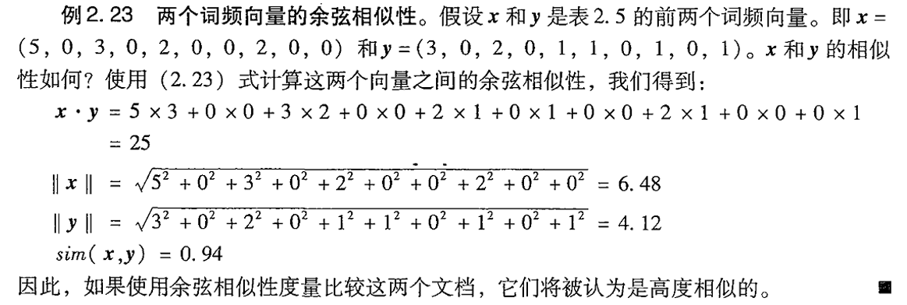

# 3 数据预处理

## 3.1 概述

数据预处理的目的：提高数据质量

**数据质量的要素：准确性、完整性、一致性、时效性、可信性和可解释性**

数据预处理主要包括：数据清理、数据集成、数据归约和数据变换

## 3.2 数据清理

任务：属性的选择与处理，填写缺失值；光滑噪声数据；识别或删除离群点；解决不一致不平衡的数据

属性选择与处理原则：

- 尽可能赋予属性名和属性值明确的含义
- 统一多数据源的属性值编码
- 处理**唯一**属性，如`ID，姓名`等
- 去除**重复**属性（表示同一信息），如出生日期和年龄

---

填写空缺值：

- 忽略元组
- 忽略属性列
- 人工填写空缺值
- 使用属性的中心度量值填写空缺值
  - 如果数据分布正常，使用均值填充
  - 如果数据分布倾斜，使用中位数填充
- 使用全局变量填充，如固定值等
- 使用可能得特征值来填充，即预测出来的值（最常用）

---

噪声数据：错误或异常的数据，对正常分析造成了干扰

噪声数据处理：

-  :star: 分箱（目的：用来光滑局部数据） :star: 

> 操作：按照属性值划分若干个子区间（箱子），如果一个属性值处于某个子区间范围内，就把该属性值放进这个子区间代表的箱子内
>
> 三种方法：
>
> - 统一权重：所有箱子里面**样本的数目**相等
> - 统一区间：所有箱子属性取值**区间的长度**相同
> - 自定义：用户自定义
>
> 利用分箱去除噪声：
>
> - 均值平滑：用箱子内的均值代替每个样本的属性取值
> - 箱边界平滑：用箱的边界值代替每个样本的属性取值

- 利用聚类处理噪声
- 离群点分析
- 计算机和人工检查结合
- 利用回归处理噪声

---

不平衡数据（正负样本不均衡）的处理：

方法：

- 过抽样
  - 通过增加少数类样本来提高少数类的分类性能
  - 如复制少数类样本
  - 存在问题：没有给少数类增加任何新的信息，而且可能会导致过度拟合
- 欠抽样
  - 通过减少多数类样本来提高少数类的分类性能
  - 通过随机地去掉一些多数类样本来减少多数类的规模
  - 存在问题：会丢失多数类的一些重要信息

## 3.3 数据集成

将不同来源的数据进行集成处理，要注意采取措施避免集成时的冗余：例如代表同一概念的属性在不同的数据库中可能具有不同的名字，导致不一致和冗余。

- 冗余和相关性分析

- 卡方检验（标称属性）

- 相关系数和协方差（数值属性）

---

变量之间的关系：

- 相关关系（正相关，负相关）

> - 不能用函数关系精确表述
>
> - 一个变量的取值不能由另一个变量来唯一确定
> - 变量x取某个值时，变量y的取值可能有几个

- 函数关系（存在确定性的依存关系）

相关分析：用一个指标来表明现象间相互依存关系的密切程度。广义的相关分析包括相关关系的分析（狭义的相关分析）和回归分析。

---

对于标称属性 $A, B$ ，假设 $A$ 有`c` 个不同值 $a_1, a_2, \cdots, a_c$ ，$B$ 有`r`个不同取值 $b_1, b_2, \cdots, b_r$，可以通过**相依表**计算卡方值：
$$
\chi ^ 2 = \sum \limits _{i = 1}^c \sum \limits _{i = 1}^r \frac{(o_{ij} - e_{ij}) ^ 2}{e_{ij}} \\
e_{ij} = \frac{count(A = a_i) \times count(B = b_i)}{n} \\
o_{ij}是事件的观测频度（实际计数），e_{ij}是期望频度，可通过上式计算
$$


---

相关系数分析（皮尔逊相关系数）
$$
r_{A, B} = \frac{\sum \limits_{i = 1} ^n (a_i - \bar A) (b_i - \bar B)}{(n - 1) \sigma_A \sigma_B} = \frac{\sum \limits_{i = 1} ^n (a_ib_i) - n \bar A \bar B}{(n - 1) \sigma_A \sigma_B}
$$
若 $r_{A, B} > 0$ ，属性A和B呈正相关，值越大，相关性越强

若 $r_{A, B} = 0$ ，A和B独立

若 $r_{A, B} < 0$ ，A和B负相关

> - 相关并不意味着存在因果关系
> - 相关系数为0，不一定不相关，只能说不存在线性相关
> - 相关系数具有对称性

---

协方差：评估两个属性是如何一起变化的
$$
Cov(A, B) = E((A - \bar A)(B - \bar B)) = E(AB) - \bar A \bar B \\
r_{A, B} = \frac{Cov(A, B)}{\sigma_A \sigma_B} \\
D(X) = E(X^2) - \bar X ^2
$$
若 $Cov(A, B) > 0$ ，说明属性A和B同时大于或小于期望值

若 $Cov(A, B) = 0$ ，说明两者相互独立

若 $Cov(A, B) < 0$ ，说明A大于期望值的同时，B小于期望值

## 3.4 数据归约

目的：在保证数据完整的前提下，减少原始数据量

数据归约可以用来得到数据集的归约表示，它小得多，但可以产生相同的（或几乎相同的）分析结果。**其花费的计算时间不应超过或“抵消”在归约后的数据挖掘上挖掘所节省的时间。**

1. 维归约

减少属性个数，找到最小的属性集，使得数据集的概率和原分布尽可能相等。

选择属性的最有子集可以通过决策树归纳的方法。

2. 数量归约

- 参数化数据规约：回归方式，拟合数据
- 非参数化数据规约：直方图（分箱），聚类，抽样等方式
- 数据立方体聚集

3. 数据压缩：

- 有损压缩：音视频压缩（如小波变换和主成分分析PCA）

> 离散小波变换（DWT）仅存放一小部分最强的小波系数
>
> DWT是一种更好的有损压缩，所需空间比DFT（离散傅里叶变换）小，小波空间局部性很好。
>
> 小波变换可用于多维数据，如数据立方体

- 无损压缩：字符串压缩（如哈夫曼压缩）

## 3.5 数据变换

### 3.5.1 数据规范化

1. 小数定标规范化：

$$
v^{'} = \frac{v}{10 ^ j}
$$

如将 $-986$ 规范化为 $-0.986$ 

2. 最小-最大规范化：

将区间映射到某一特定（如 $[0, 1]$ ）区间内，公式为：
$$
v^{'} = \frac{v - min}{max - min} \times (new\_max - new\_min) + new\_min
$$
如最大年龄为52岁，最小年龄为21岁，44岁变成了
$$
\frac{44 - 21}{52 - 21} \times (1 - 0) + 0 = 0.742
$$

3. Z-分数规范化

$$
v^{'} = \frac{v - \mu}{\sigma}
$$

如某公司员工年龄的平均值和标准差分别为25岁和11岁。请根据z-score规范化，将44岁这个数据规范化： $\frac{(44 - 25)}{11} = 1.727$

### 3.5.2 :star: 离散化 :star: 

数据集中递归地使用某种离散化技术就形成了数据集的概念分层。

`3-4-5`规则：

确定等宽区间的数目

- 如果一个区间最高有效位上跨越3，6，7或9个不同的值，就将该区间划分为3个等宽子区间；($7 \rightarrow  2,3,2$)

- 如果一个区间最高有效位上跨越2，4，或8个不同的值，就将该区间划分为4个等宽子区间；

- 如果一个区间最高有效位上跨越1，5，或10个不同的值，就将该区间划分为5个等宽子区间；

- 将该规则递归的应用于每个子区间，产生给定数值属性的概念分层；

- 对于数据集中出现的最大值和最小值的极端分布，为了避免上述方法出现的结果扭曲，可以在顶层分段时，选用一个大部分的概率空间。 如 选择5%-95%的数据，再进行以上规则的划分。

> 实例1：如某公司的销售增量在 -180~383之间，采用该规则进行划分如下，首先取定一个整的区间,向下取整-180 是 -200 ，向上取整383是400
>
> [-200,400]。最高位是百分位，最高有效位有-1、1、0、2、3，4一共6个，分成3个等宽:
>
> a1 [-200,0)       a2 [0,200)        a3[200,400)
>
> 再划分每个区间的最高有效位是2个，子区间划分4个
>
> a1 [-200,0)       a2 [0,200)        a3[200,400)
>
> a11[-200,-150) a21[0,50)         a31[200,250)
>
> a12[-150,-100)  a22[50,100)      a32[250,300)
>
> a13[-100,-50)    a23[100,150)     a33[300,350)
>
> a14[-50,0)         a24[150,200)     a34[350,400)

实例2：选择取值区间，及其边界Low和High的取值。选用一个大部分的概率空间。如 5%-95%


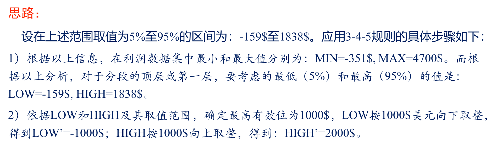

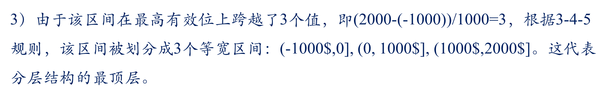

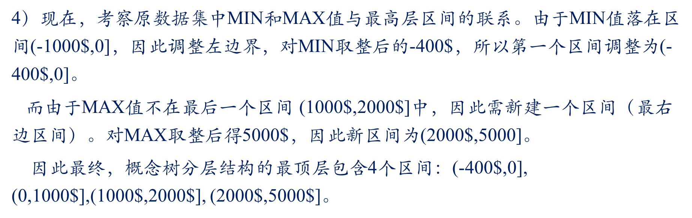

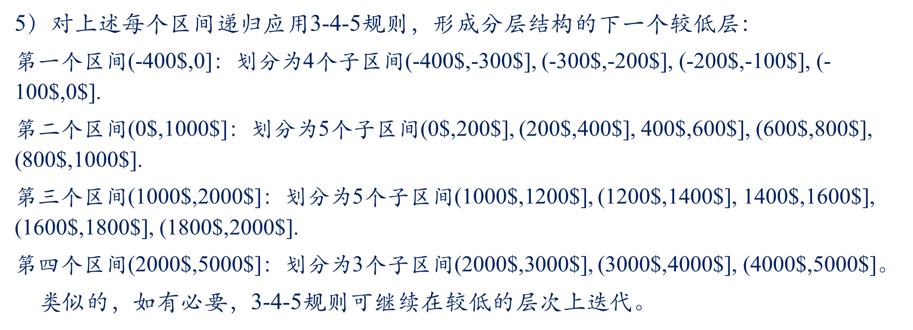


# 4 数据仓库与联机分析处理

## 4.1 数据仓库（DW）

定义：数据仓库是一个**面向主题的、集成的、时变的、非易失的**数据集合，支持管理者的决策过程

面向主题：为特定的数据分析领域提供数据支持。

数据集成的方法：统一（消除不一致的现象）和综合

DW中的数据组织以四个基本特征为基础，分为四个级别：**早期细节级，当前细节级，轻度综合级，高度综合级**

不同综合级别称之为**粒度**

> - 粒度: 数据仓库中保存数据的细化或综合程度的级别。
>
> - 细化程度越高,粒度越小; 粒度越高,所能回答查询的能力越低。
>
> - 注意: 粒度划分的决定性因素不是总数据量, 而是总的记录数。

---

数据仓库的数据组织形式：

- 简单堆积结构：数据仓库中最简单、最常用的数据组织形式。它每日从数据库中提取出来，并按相应的主题、集成为数据仓库中的记录。

- 转轮组织结构：转轮结构中, 数据存储单位分割为日， 周，月，年四级； 其中：日，周，月，分别存储当前数据，年存储每年综合数据

> 结构简洁, 数据量比简单堆积结构大大减少; 但损失了数据细节, 越久远的数据, 细节损失越多。

- 简单直接结构：可以看作是按一定时间间隔对操作型数据的一个快照

>  与简单直接结构的区别：对操作型数据不集成, 而是每间隔一定时间（如：一周,一月） 而直接存入数据仓库。

- 连续结构：通过两个连续的简单直接文件,生成另一个连续文件;也可以通过把一个快照追加到一个以前生成的连续文件上来创建

---

数据库：随着事务的变化随时更新数据库中的数据；用于事务处理；不同的管理业务需要建立不同的数据库

数据仓库：既保存过去的数据，又保存现在的数据；是大量数据库的集成；用于决策分析

## 4.2 数据仓库设计

数据集市：是一种更小、更集中的数据仓库，为公司提供分析商业数据的一条廉价途径

> 数据仓库需要大型的计算机服务器，而数据集市仅需要普通服务器

数据集市类型：

- 独立数据集市：数据来自于操作型数据库，是为了满足特殊用户而建立的一种分析型环境。

- 从属数据集市：数据来自于企业的数据仓库

数据仓库系统的组成：**数据仓库，仓库管理，分析工具（查询工具，多维分析工具等）**

元数据是数据仓库的一个综合文档，是数据仓库的核心。

元数据是定义和描述其他数据的数据，在整个数据ETL过程中起到基础作用。

> - 操作型（技术元数据）：一种是为了从操作型环境向数据仓库环境转换而建立的元数据，它包括所有源数据项的名称、属性及其在提取仓库中的转化。
> - 结构型（业务元数据）：是用来与最终用户的多维商业模型和前端工具之间建立映射的

数据仓库存储采用**多维数据模型**，数据一般是值。

数据仓库的数据模型分类：星型模型，雪花模型，星座模型

> 星型模型：**核心是事实表，围绕事实表的是维度表**
>
> 星座模型：会出现多个事实表共享某一个或多个维表的情况，这就是星座模型。

---

数据仓库的作用：

- 信息处理
- 分析处理
- 数据挖掘

## 4.3 联机分析处理OLAP

是一种软件技术，它使分析人员能够迅速、一致、交互地从各个方面观察信息，以达到深入理解数据的目的。这些信息是从原始数据转换过来的，按照用户的理解，它反映了企业真实的方方面面。

OLAP是在OLTP的基础上发展过来的。

> OLTP：以数据库为基础， 面对的是操作人员和低层管理人员，属于日常业务系统
>
> OLAP：以数据仓库为基础的数据分析处理，面向管理者的决策支持系统，有两个特点：
>
> - 在线性，以客户机/服务器架构为基础
> - 多维分析，核心所在

OLAP准则：

- 多维数据分析
- 客户/服务器结构
- 多用户支持
- 一致的报表性能

OLAP按照存储方式可以分为：

- ROLAP（关系OLAP）：基于关系数据库，采用星型模型

- MOLAP（多维OLAP）：基于多维数据库，采用类似**多维数组**的结构
- HOLAP（混合OLAP）：采用多维数据表来存储，采用ROLAP星型结构存储

---

OLAP基本操作：

- 切片：在给定的数据立方体上的一个维进行选择操作, 得到一个子立方体
- 切块: 在给定的数据立方体的两个或多个维上进行选择, 得到一个子立方体
- 钻取：钻取有向下钻取（drill down ）和向上钻取（drill up ）操作。
  - 向下钻取是使用户在多层数据中能通过导航信息而获得更多的**细节性**数据。
  - 向上钻取获取概括性的数据，又称上卷，是一种聚集操作
- 旋转：旋转可以得到不同视角的数据。旋转操作相当于平面数据将坐标轴旋转。例如，旋转可能包含了交换行和列，或是把某一个行维移到列维中去。
- 转轴：改变一个报告或页面显示的维方向，以得到不同视角的数据

原始数据模型：


操作后的模型：


# 6 频繁模式挖掘

## 6.1 概述

$$
support(X \Rightarrow Y) = \frac{包含X和Y的事务数}{事务总数} \times 100 \%  \\
confidence(X \Rightarrow Y) = \frac{包含X和Y的事务数}{包含X的事务数} \times 100 \% \\
confidence(X \Rightarrow Y) = \frac{support(X \Rightarrow Y)}{support(X)}
$$

满足下述条件的为关联规则为强规则，否则为弱规则：
$$
support(X \Rightarrow Y) \ge min\_sup \\
confidence(X \Rightarrow Y) \ge min\_conf
$$


强规则 $X \Rightarrow Y$ 对应的项集（$X \cup Y$）必是**频繁集**。故关联规则挖掘可分为两个步骤：

- 根据支持度找到所有频繁项集。（核心内容）
- 根据频繁项集和最小置信度产生关联规则。（较易实现）

关联规则分类：

1. 基于规则中处理的变量的类别

- 布尔型关联规则
- 量化型关联规则

> 性别=女 => 职业=秘书，是布尔型关联规则；
>
> 性别=女 => avg（月收入）= 2300，涉及的收入是数值类型，所以是一个量化型关联规则。

2. 基于规则中数据的抽象层次

- 单层的关联规则
- 多层的关联规则

3. 基于规则中涉及到的数据的维数

- 单维关联规则
- 多维关联规则

## 6.2 频繁项集挖掘算法

### 6.2.1 Apriori算法

挖掘**布尔关联规则频繁项集**的算法

Apriori算法由连接和剪枝两个步骤组成

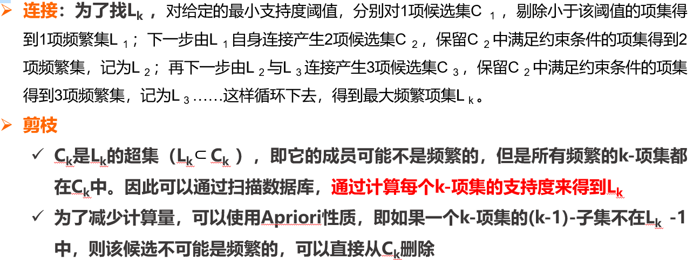


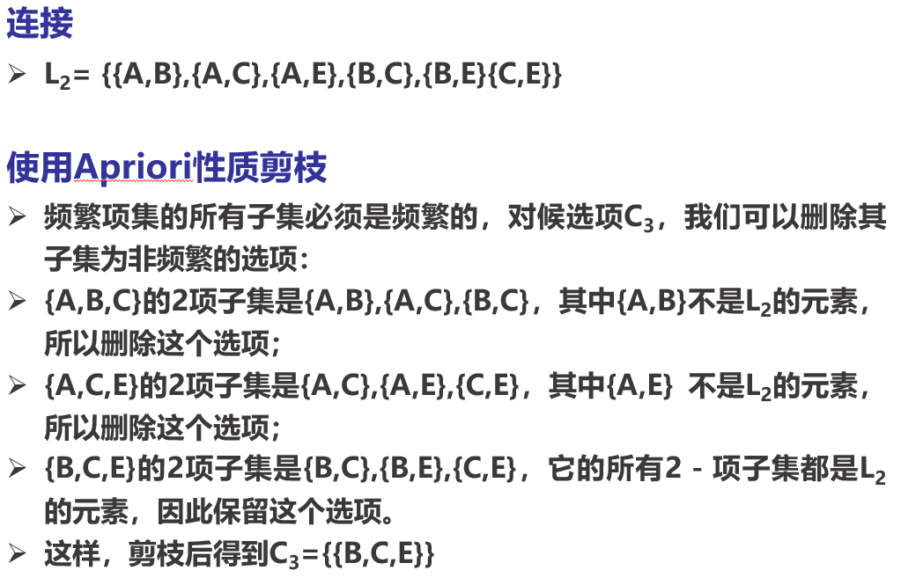

挑战：

- 对数据库要多次扫描
- 产生大量的候选项集
- 对候选项集的支持度计算非常繁琐

### 6.2.2 FP树（具体步骤查看课件P41）

不产生候选频繁项集，采用分支策略

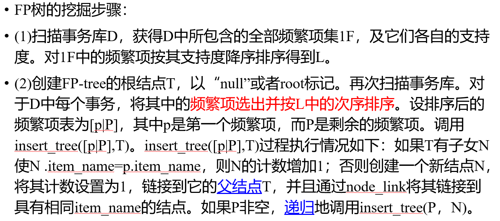


### 6.2.3 挖掘闭模式和极大模式

**闭频繁项集：**就是指一个项集X，它的**直接超集**的支持度计数都不等于它本身的支持度计数

极大频繁项集：如果频繁项集L的所有超集都是非频繁项集，那么称L为**极大频繁项集**

> **极大频繁项集是闭频繁项集**，而**闭频繁项集不一定是极大频繁项集**。

## 6.3 模式评估

评估方法：

- 客观度量：置信度和支持度
- 主观度量

提升度：
$$
lift = \frac{P(A \cup B)}{P(A) P(B)}
$$

- 提升度大于1，则说明A和B是正相关的

- 小于1，则说明A和B是负相关的

- 等于1，则说明A和B是独立的

> 只有提升度和卡方度量不是**零不变度量**，但是其他度量也会面临不平衡问题。

不平衡比：
$$
IR(A, B) = \frac{|sup(A) -sup(B)|}{sup(A) + sup(B) - sup(A \cup B)}
$$
**由于数据的倾斜，导致两个数据集的关联性难以度量，采用不平衡比可以度量数据的倾斜型**

# 8 分类

## 8.1 概述

- 有指导的学习（用于分类）

- 无指导的学习（用于聚类）

## 8.2 决策树

### 8.2.1 概述

决策树算法：

- 第一个决策树算法: CLS （Concept Learning System）
- 使决策树受到关注、成为机器学习主流技术的算法: ID3
- 最常用的决策树算法: C4.5
- 可以用于回归任务的决策树算法: CART （Classification and Regression Tree）
- 基于决策树的最强大算法: RF （Random Forest）

决策树由下面几种元素构成：

- 根节点：包含样本的全集（全部训练数据）
- 内部节点：对应特征属性测试
- 叶节点：代表决策的结果

整体策略：自上而下分而治之

决策树的构建过程就是一个**自根至叶的递归过程**， 在每个中间结点寻找一个**划分**属性。

大致过程：

- 开始：构建根节点，所有训练数据都放在根节点，选择x个最优特征，按着这一特征将训练数据集分割成子集，进入子节点。
- 所有子集按内部节点的属性递归地进行分割。
- 如果这些子集已经能够被基本正确分类，那么构建叶节点，并将这些子集分到所对应的叶节点去。
- 每个子集都被分到叶节点上，即都有了明确的类，这样就生成了一颗决策树。

递归的三种停止条件：

- 当前结点包含的样本全属于同一类别，无需划分；
- 当前属性集为空，或是所有样本在所有属性上取值相同，无法划分;
- 当前结点包含的样本集合为空，不能划分。

---

:star: :star: 

**信息熵**：随机变量的不确定性。
$$
H(X) = - \sum p_i log_2 p_i \hspace{2em} \text{i = 1, 2, ..., n}
$$

条件信息熵：
$$
H(X | y_i) = - \sum \limits _i p(x_i|y_j) log_2 p(x_i|y_j) \\
H(X | Y) =  \sum \limits _j p(y_j) H(X|y_j) \hspace{2em}
$$

### 8.2.2 ID3

下面是基于信息增益的ID3算法的实例：

我们有14天的数据，4个特征条件：**天气，温度，湿度，是否有风**。最终结果是去玩不玩。


上面有四种划分方式，我们需要判断谁来当根节点，根据的主要就是信息增益这个指标。下面计算信息增益来判断根节点。

本例暂且以`ent(a, b)`代表以下含义：（只有两种结果的时候的熵值计算）

```python
from math import log2
def ent(a, b):
    tot = a + b
    x, y = a / tot, b / tot
    return -(x * log2(x) + y * log2(y))
```

总的数据中，9天玩，5天不玩，熵值为：
$$
-\frac{9}{14}log_2 \frac{9}{14} - \frac{5}{14}log_2 \frac{5}{14} = 0.940
$$
然后对4个特征逐个分析：

- outlook

  - `outlook = sunny`时，熵值为0.971，取值为sunny的概率为 $\frac{5}{14}$
  - `outlook = overcast`时，熵值为0，取值为overcast的概率为 $\frac{4}{14}$
  - `outlook = rainy`时，熵值为0.971，取值为rainy的概率为 $\frac{5}{14}$

  熵值为：
  $$
  \frac{5}{14} \times 0.971 + \frac{4}{14} \times 0 + \frac{5}{14} \times 0.971 = 0.693
  $$
  信息增益：系统熵值从0.940下降到0.693，增益为0.247。

- temperture

  - `temperture = hot`时，熵值为1.0（`ent(2, 2)`），取值为hot的概率为$\frac{4}{14}$
  - `temperture = mild`时，熵值为0.918（`ent(4, 2)`），取值为mild的概率为$\frac{6}{14}$
  - `temperture = cool`时，熵值为0.81（`ent(3,1)`），取值为cool的概率为$\frac{4}{14}$

  熵值为：
  $$
  \frac{4}{14} \times 1.0 + \frac{6}{14} \times 0.918 + \frac{4}{14} \times 0.81 = 0.911
  $$
  信息增益：$Gain(S, temperture) = 0.940 - 0.911 = 0.029$

- 其他特征按照相同方法来做得到：

$$
Gain(S，Outlook)=0.247  \\
Gain(S, Humidity)=0.151  \\
Gain(S, Wind)=0 .048 \\
Gain(S,Temperature)=0 .029
$$


计算出所有的信息增益之后，选择**有最大的信息增益的特征**作为根节点。

下面找Sunny分支的决策树划分：

总的熵值
$$
-\frac{2}{5} \times log_2(\frac{2}{5}) - \frac{3}{5}log_2(\frac{3}{5}) = 0.97
$$
以剩下的三个特征进行分析：

- temperture

  - temperture=hot，熵值为0，概率为$\frac{2}{5}$
  - temperture=mild，熵值为1.0，概率为$\frac{2}{5}$
  - temperture=cool，熵值为0，概率为$\frac{1}{5}$

  熵值为$\frac{2}{5}$

  信息增益：$0.97-0.4 = 0.57$

- humidy

  - high，熵值为0，概率为$\frac{3}{5}$
  - normal，熵值为1，概率为$\frac{2}{5}$

  熵值为$\frac{2}{5}$

  信息增益：$0.97 - 0.4 = 0.57$

- windy

  - false，熵值为0.918，概率为$\frac{3}{5}$
  - true，熵值为1，概率为$\frac{2}{5}$

  熵值为$0.951$

  信息增益：$0.97 - 0.95 = 0.02$

故选择humidy或wind划分

剩下的划分同理，最终决策树为


### 8.2.3 C4.5（信息增益率）

> 基于信息增益的决策树算法会有哪些问题：
>
> 如果有一个特征：id，代表样本的编号，以上述数据为例，id为从1到14，如果计算id特征的根节点，发现信息增益是最大的，因为每一个子节点的信息熵值都为0。

信息增益率：（解决了ID3的问题，考虑自身熵，信息增益除以自身熵）
$$
\frac{G}{H(x)} \hspace{2em} \text{G:信息增益, H(x):熵值}
$$

### 8.2.4 CART（GINI系数） 

使用基尼系数作为衡量标准。
$$
Gini(p) = \sum \limits _{k = 1}^K p_k (1 - p_k) = 1 - \sum \limits _{k = 1}^K p_k^2
$$

### 8.2.5 :star:决策树剪枝:star:

剪枝算法主要分为两类：从上往下剪枝和从下往上剪枝。

- 上往下剪枝遍历所有节点从根开始剪枝，也称为预剪枝。

- 从下往上剪枝是从叶节点开始从下往上剪枝，也称为后剪枝。

> 时间开销：
>
> - 预剪枝：训练时间开销降低，测试时间开销降低
>
> - 后剪枝：训练时间开销增加，测试时间开销降低
>
> 过/欠拟合风险：
>
> - 预剪枝：过拟合风险降低，欠拟合风险增加
>
> - 后剪枝：过拟合风险降低，欠拟合风险基本不变
>
> 泛化性能：后剪枝 通常优于 预剪枝

## 8.3 贝叶斯分类

特征向量 $X = {X_1, X_2, \cdots, X_n}$  ，$X_i$ 之间相互独立
$$
P(X|Y) = \prod \limits _{i = 1} ^n P(X_i | Y) \\
P(Y|X) = \frac{P(Y) \prod \limits _{i = 1} ^n P(X_i | Y)}{P(X)} \\
P(Y = y|X) = \frac{P(Y = y) \prod \limits _{i = 1} ^n P(X_i | Y = y)}{P(X)}
$$

## 8.4 基于规则的分类

## 8.5 模型评估和选择

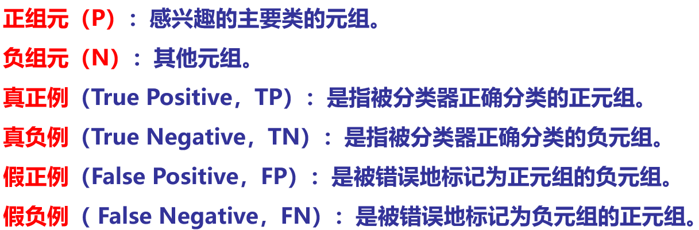


$$
Accuracy = \frac{TP + TN}{TP + FP + FN + TN} \\
precision = \frac{TP}{TP + FP} \\
Recall = \frac{TP}{TP + FN} \\
F = \frac{2 \times precision \times recall}{precision + recall} \\
F_{\beta} = \frac{(1 + \beta ^ 2) \times precision \times recall}{\beta ^ 2 \times (precision + recall)}
$$
**精确率衡量的是模型发现正样本相关性的能力，而召回率则是衡量模型在整个数据集中发现正样本的能力**，并且可以发现两者的结果都是越大越接近于1越好。

**最理想的情况就是在取得高召回率的同时还能保持较高的精确率**。F-score是一个统一的指标来衡量模型的召回率与精确率。

所以，对于一个分类模型来说，如果想要在精确率和召回率之间取得一个教好的平衡，最大化值F1是一个有效的方法。

---

为防止出现过拟合，通常将样本划分训练集和验证集，方法为：

- 留出法：直接将数据集划分为两个互斥的集合，训练集合和测试集合，模型在验证集上的表现就是对模型泛化能力的一种估计。

> 使用留出法得到的估计往往不够稳定可靠

- K-折交叉验证 :star:


- 留一法：只使用原本样本中的一项来当做验证资料， 而剩余的则留下来当做训练资料。

---

ROC曲线：是一种比较两个分类模型的可视化工具。

ROC曲线显示了给定模型的真正例率和假正例率之间的权衡。

$TPR=TP/(TP+FN)$ 所有真实类别中为1的样本,预测为1的比例。（就是正类别的召回率）

$FPR=FP/(FP+TN)$ 所有真实类别中为0的样本，预测为1的比例。（就是负类别的召回率）

- **TPR越大越好，且FPR越小越好**，反应在图像上就是TPR越靠上、FPR越靠左。
- **单个模型评估**：曲线越靠近左上，模型分类性能更好
- **多个模型评估**：要分两种情况讨论
  - 情况1：在ROC曲线上，模型1完全包裹模型2，则模型1性能更好
  - 情况2：在ROC曲线上，模型1不完全包裹模型2，则无法判断，需要借助AUC面积评估

> ROC曲线找最优阈值的逻辑是，ISO精度线与ROC曲线相切时，ACC取得最大，ACC取得最大时，对应的就是最优阈值。
>
> AUC面积：又称ROC曲线下的面积，它描述的是分类器C随机抽取的一个正例的预测概率大于一个负例的预测概率的概率。取值范围为 $[0.5, 1]$

## 8.6 提高分类准确率

- **装袋**：在同一个数据集上采用有放回抽样的方式产生k个训练集，然后在这k个训练集上训练k个分类模型Mi。对于未知样本，每个分类器Mi返回相应的预测结果，最后通过投票决定最终分类结果。
- **提升**：对每个训练样本赋予一个代表其分类困难程度的权重，权重越高，错误分类的可能性越低。随着迭代的进行，每个元组的权重动态改变，如果元组正确分类，则其权重减少，否则权重增加。权重决定着有放回抽样的概率，权重越大，被抽中的概率也越大
- **随机森林**：多棵树产生的一种组合分类模型。随机体现在两方面：生成决策树的数据集是随机抽取产生的；每棵树训练样本的属性集也是随机产生的。其最终结果由多颗决策树投票产生。

# 10 聚类

## 10.1 概述

聚类方法分类：

- 基于划分的聚类
- 基于层次的聚类
- 基于密度的聚类
- 基于网格的聚类

## 10.2 划分方法

K-Means算法和PAM算法都是基于划分的。

K-Means算法：

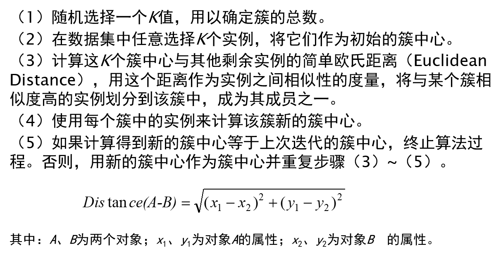

对下表数据进行聚类：

| **Instance** | **x** | **y** |
| ------------ | ----- | ----- |
| **1**        | 1.0   | 1.0   |
| **2**        | 2.0   | 1.5   |
| **3**        | 4.0   | 3.5   |
| **4**        | 5.0   | 4.5   |
| **5**        | 3.5   | 5     |

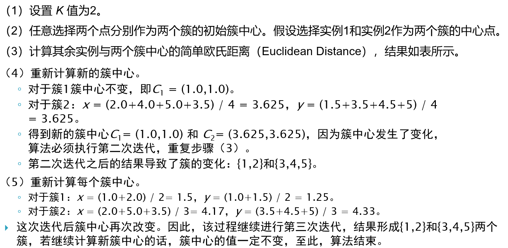

特点：

- 结果簇密集且区分明显，效果较好
- 复杂度 $O(nkt)$ ，`t`为迭代次数，大数据效率较高
- 算法常以局部最优结束
- 缺点：对噪声和孤立点敏感

K-mediod的特点：

- k-mediod弥补了k-means算法的缺点，k-mediod对噪声和孤立点不敏感.

- K-mediod对于大规模数据聚类就显得力不从心,只能适应较小规模的数值聚类.

## 10.3 层次方法

分为凝聚法和分裂法。

> 凝聚法：也称为自底向上的方法，开始将每个对象形成单独的簇，然后逐次合并相近的对象或簇，直到满足终止条件。
>
> 分裂法：也称为自顶向下的方法，开始将所有对象放入一个簇中，每次迭代，簇分裂为更小的簇，直到满足终止条件。 

**凝聚法的基本思想**：先将n个样品各自看成一类，然后规定样品之间的“距离”和类与类之间的距离。选择**距离最近**的两类合并成一个新类，计算新类和其它类（各当前类）的距离，再将距离最近的两类合并。这样，每次合并减少一类，**直至所有的样品都归成一类为止**。 

凝聚法的方法：

- 最短距离法
- 最长距离法
- 中间距离法
- 重心法
- 类平均法

特点：

- 聚类过程不能撤销
- 可扩展性差：时间复杂度最小为 $O(n ^ 2)$

## 10.4 基于密度的方法

DBSCAN（具有噪声的基于密度的聚类方法）是一种**基于密度的空间聚类算法**。该算法将具有足够密度的区域划分为簇，并在具有噪声的空间数据库中发现任意形状的簇，DBSCAN算法将`簇`定义为密度相连的点的最大集合。

核心对象：若某个点的密度达到算法设定的阈值则称其为核心点。（即`r`邻域内的点的数量不小于`minPts`）

基于以上密度的定义，我们可以将样本集中的点划分为以下三类：

- **核心点**：在半径r区域内，含有超过MinPts数目（最小数目）的点，称为核心点；
- **边界点**：在半径r区域内，点的数量小于MinPts数目，但是是核心点的直接邻居；
- **噪声点**：既不是核心点也不是边界点的点

> 噪声点是不会被聚类纳入的点，边界点与核心点组成聚类的“簇”。

一些概念：

- **直接密度可达（密度直达）**：如果p在q的r领域内，且**q是一个核心点对象**，则称对象p从对象q出发时直接密度可达，反之不一定成立，即密度直达不满足对称性。
- **密度可达**：如果存在一个对象链q–>e–>a–>k–>l–>p，任意相邻两个对象间都是密度直达的，则称对象p由对象q出发密度可达。密度可达满足传递性。
- **密度相连**：对于 $x_i$ 和 $x_j$ ,如果存在核心对象样本 $x_k$ ，使 $x_i$ 和 $x_j$ 均由 $x_k$ 密度可达，则称 $x_i$ 和 $x_j$ 密度相连。**密度相连关系满足对称性**。

> 核心点能够连通（密度可达），它们构成的以r为半径的圆形邻域相互连接或重叠，这些连通的核心点及其所处的邻域内的全部点构成一个簇。

1. DBSCAN通过检查数据集中每个点的`r`邻域来搜索簇，如果点`p`的`r`邻域包含多于MinPts个点，则创建一个以p为核心对象的簇；
2. 然后，DBSCAN迭代的聚集从这些核心对象直接密度可达的对象，这个过程可能涉及一些密度可达簇的合并；
3. 当没有新的可添加到任何簇时，迭代过程结束。

优缺点：

- 优点：无需知道簇的数量；基于密度定义，可以对抗噪声；能处理任意形状和大小的簇

- 缺点：当簇的密度变化太大时候，聚类得到的结果会不理想；对于高维问题，密度定义也是一个比较麻烦的问题。

## 10.5 基于网格的方法

STING是一个基于网格的多分辨率聚类技术，它将空间区域划分为矩形单元。

关于每个网格单元属性的统计信息（例如平均值，最大值，和最小值）被预先计算和存储。这些统计变量包括：属性无关的变量 count；属性相关的变量 m（平均值），s（标准偏差），min（最小值），max（最大值），以及该单元中属性值遵循的分布类型 distribution，例如正态的，均衡的，指数的，或无（如果分布未知）。当数据被装载进数据库，最底层单元的变量 count，m，s，min，和 max 直接进行计算。 
$$
n = \sum \limits_i n_i \\
m = \frac{\sum \limits _i m_i n_i}{n} \\
s = \sqrt{\frac{\sum \limits _i (s_i ^ 2 + m_i^ 2) n_i}{n} - m^2} \\
min = min(min_i) \\
max = max(max_i)
$$
优点：

- 计算是独立于查询的
- 利于并行处理和增量更新
- 效率高，只需扫描数据库一次，复杂度为 $O(n)$

缺点：

- STING的聚类质量取决于网格结构的最底层的粒度。如果最底层的粒度很细，则处理的代价会显著增加。然而如果粒度太粗，聚类质量难以得到保证。
- 所有的簇边界不是水平的，就是竖直的，没有斜的分界线。降低了聚类质量。

## 10.6 聚类评估

聚类评估主要的任务包括：

- 估计聚类趋势：对于给定的数据集，评估该数据集是否存在非随机结构

- 确定数据集中的簇数：如K-均值算法需要将簇的数目作为参数

- 测定聚类质量：评估结果簇的质量

