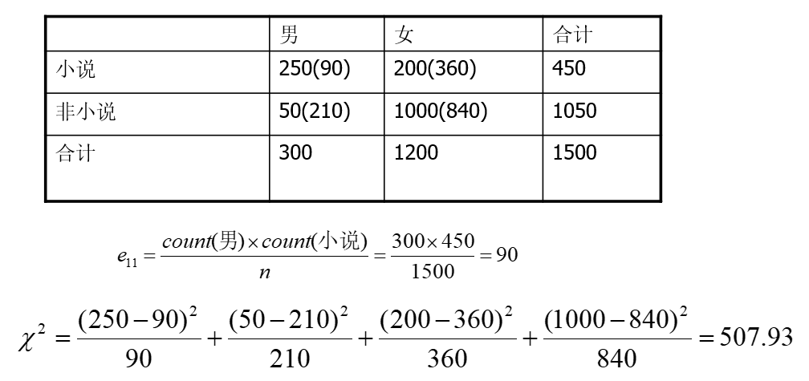

# DM

2023题型：选择15分，填空15分，判断15分，简答30分，综述25分

# 1 概述

数据挖掘定义：从海量数据中抽取感兴趣的模式和知识的过程；从存放在数据库、数据仓库中或其他信息库中的大量数据中挖掘有趣知识的过程。

:rocket: 数据挖掘步骤： :rocket:

（1）准备数据集

> 可以从传统数据库，数据仓库或平面文件中获取

（2）选择数据挖掘算法，进行数据挖掘

（3）解释和评估

（4）模型应用

---

机器学习的分类：监督学习，无监督学习，半监督学习，主动学习

半监督学习：半监督学习使用大量的未标记数据，以及同时使用标记数据，来进行数据挖掘工作。标记的实例用来学习模型，未标记的数据用来改进类边界。

主动学习：主动学习通过一定的算法查询**最有用的未标记样本**，并交由专家进行标记，然后用查询到的样本训练分类模型来提高模型的精确度

# 2 认识数据

## 2.1 数据对象与属性类型

属性（维度，特征，变量）：一个数据字段，表示一个数据对象的某个特征。

> 类型有：标称属性，二元属性，序列属性，数值属性

枚举或标称属性：能够用有限个元素对属性进行描述的集合。如`头发颜色 = {黑色，棕色，灰色，淡黄色}`

二值属性：只有两个状态的枚举属性。

序列属性：值的顺序具有意义的属性。如`尺寸 = {小，中，大}，成绩`等

数值属性：可用整数或实数进行度量的属性。如`身高，体重，收入`

> 区间标度属性：使用相等的单位尺度度量，可以定量评估属性值的差
>
> - 取值有顺序（如摄氏度和华氏度）
> - 没有真实零点
>
> 比率标度属性：具有固定零点的数值属性，如工作年限，重量，高度等

同时属性也可分为：**离散属性和连续属性**

---

数据的计量尺度：（由低级到高级）

定类尺度：按照事物的某种属性对其进行平行的分类或分组，如性别（男，女）

> - 具有 $=$ 和 $\neq$ 的数学特性
> - 数据表现为类别

定序尺度：是对事物之间等级和顺序差别之间的一种测度，如产品等级（一等品，二等品）

> - 具有 $<$ 和 $>$ 的数学特性
> - 数据表现为类别，但有序

定距尺度（间隔尺度）：是对事物类别或次序之间的间距的测度，如100分制考试成绩

> - 具有 $+$ 和 $-$ 的数学特性
> - 可排序，也可指出类别之间的差距
> - 没有绝对零点（`0是测量尺度上的一个测量点，并不代表没有`）

定比尺度：能够测量两个测度值之间比值的一种计量尺度。如职工月收入，企业产值

> - 除具备上述三种的所有特点外，还可计算两个测度值之间的比值
> - 有绝对零点
> - 具有 $+ - \times \div$ 的数学特性

## 2.2 数据的基本统计描述

中心趋势度量：均值，中位数，众数，中列数

数据的散布：极差，四分位数，方差，标准差，四位数极差

### 2.2.1 中心趋势度量

样本平均数：（样本均值是一个无偏估计量，所以分母就是 $n$ ）
$$
\bar x = \dfrac{x_1 + x_2 + \cdots + x_n}{n} = \frac{\sum \limits_{i = 1}^n x_i}{n}
$$
总体平均数：
$$
\mu = \dfrac{x_1 + x_2 + \cdots + x_N}{N} = \frac{\sum \limits_{i = 1} ^ N x_i}{N}
$$

- 易受极端值影响
- 数据对称分布或接近对称分布时应用

---

中位数：
$$
M_e = 
\begin{cases}
X_{\frac{N + 1}{2}}, & N为奇数 \\
\frac{1}{2} (X_{\frac{N}{2}} + X_{\frac{N}{2} + 1}), & N为偶数
\end{cases}
$$

- 数据分布偏斜成都较大时应用

---

众数：出现次数最多的数

- 不受极端值的影响
- 可能没有众数或有多个众数
- 数据分布偏斜程度较大且有明显峰值时应用

---

中列数：数据集中最大最小值的平均值 $(max + min) / 2$

### 2.2.2 散布度量

极差：最大值与最小值之差

> - 离散程度的最简单测度值
>
> - 易受极端值影响
>
> - 未考虑数据的分布

分位数：数据分布的每隔一定间隔的点。如四分位数，分别为 $Q_1$ ，中位数，$Q_3$ 
$$
1. &
\begin{cases}
Q_1 = \frac{n}{4} \\
Q_3 = \frac{3n}{4}
\end{cases} \\
2. &
\begin{cases}
Q_1 = \frac{n + 1}{4} \\
Q_3 = \frac{3(n + 1)}{4}
\end{cases}
$$
四分位数极差：$IQR=Q_3-Q_1$ 

>- 不受极端值影响

方差和标准差：
$$
总体方差：\sigma ^ 2 = \frac{\sum \limits _{i = 1} ^ N (x_i - \mu) ^ 2}{N} & 总体标准差：\sigma \\
样本方差：s ^ 2 = \frac{\sum \limits_{i = 1} ^ n (x_i - \bar x) ^ 2}{n - 1} & 样本标准差： s
$$

> 总体：研究对象的全体
>
> 样本：从总体中随机抽取的部分观察单位
>
> 样本方差分母为何要是 $n - 1$ ，证明：[https://blog.csdn.net/Hearthougan/article/details/77859173](https://blog.csdn.net/Hearthougan/article/details/77859173) ，要保证样本方差是总体方差的一个无偏估计

### 2.2.3 图形显示

#### 2.2.3.1 :star: 盒图 :star: 

由一个箱子，两条线段组成

5个特征值：最大值，最小值，中位数Me，两个四分位数$Q_L, Q_R$

最小值：$Q_L - 1.5 \times IQR$

最大值：$Q_R + 1.5 \times IQR$

> 在 $[Q_L - 1.5 \times IQR, Q_R + 1.5 \times IQR]$ 范围外的视为异常值，不用做最大最小值

#### 2.2.3.2 直方图

直方图相比盒图能描述更多的数据细节

#### 2.2.3.3 分位数图

是一种观察单变量数据分布的方法，描绘出了分位数信息。

#### 2.2.3.4 分位数-分位数图

 是一种衡量单变量的不同分布之间的对比情况。

#### 2.2.3.5 散点图

是一种确定两个变量之间是否存在联系、模式或趋势的图形方法。

有正相关，负相关，线性无关三种情况

## 2.3 数据可视化

- 基于像素的可视化

- 几何投影可视化
- 散点图矩阵

- 基于图符的可视化

- 层次可视化

- 可视化复杂对象和关系

## 2.4 数据相似度和相异度的度量

相似性，相异性，邻近性（相似性或相异性都称为邻近性）

### 2.4.1 枚举属性的相邻性度量

相异性矩阵：

**标称（枚举）属性**之间的相异性：标称属性的状态数为 $M$ ， 数据对象 $i$ 和 $j$ 之间的相异性为
$$
d(i, j) = \frac{p - m}{p},m为匹配的数目，p是对象的属性总数
$$
相似性计算为：
$$
sim(i, j) = 1 - d(i, j) = \frac{m}{p}
$$

### 2.4.2 二元属性的相邻性度量

二元属性的相异性：

数据对象 $i$ 和 $j$ 的相异性：
$$
d(i, j) = \frac{r + s}{q + r + s + t}
$$
非对称的二元相异性：
$$
d(i, j) = \frac{r + s}{q + r + s}
$$
非对称的二元相似性（又称为Jaccard系数）
$$
sim(i, j) = \frac{q}{q + r + s} = 1 - d(i, j)
$$

### 2.4.3 数据的相异性

度量标准通常有两种：**距离和相似性系数**

距离度量方法：欧几里得距离，切比雪夫距离，曼哈顿距离，闵科夫斯基距离，兰氏距离

欧几里得距离：
$$
二维空间：d = \sqrt{(x_1 - x_2) ^ 2 + (y_1 - y_2) ^ 2}
$$
切比雪夫距离：
$$
二维空间：d = max(|x_1 - x_2|, |y_1 - y_2|)
$$
曼哈顿距离：
$$
二维空间：d = |x_1  - x_2| + |y_1 - y_2|
$$
闵科夫斯基距离：（闵科夫斯基距离不是一种距离，而是一组距离的定义）

对数据量纲敏感，一般需要进行数据的标准化。
$$
i = (x_{i1}, x_{i2}, \cdots, x_{ip}), j = (x_{j1}, x_{j2}, \cdots, x_{jp}) \\
d(i, j) = \sqrt[h]{|x_{i1} - x_{j1}| ^ h + \cdots + |x_{ip} - x_{jp}| ^ h}
$$
兰氏距离：（被称为马氏距离的加权版本，对数据的量纲不敏感）
$$
d(x, y) = \sum \limits _{i = 1} ^ n \frac{|x_i - y_i|}{|x_i| + |y_i|}
$$

### 2.4.4 序数属性的邻近性度量

将序数属性中的值按序映射为对应的值

### 2.4.5 混合属性的邻近性度量

余弦相似性：
$$
x = (x_1, x_2, \cdots, x_p), y = (y_1, y_2, \cdots, y_p) \\
sim(x, y) = \frac{x \cdot y}{||x|| \ ||y||} = \frac{x_1y_1 + \cdots + x_py_p}{\sqrt{x_1^2 + \cdots + x_p^2} \sqrt{y_1^2 + \cdots + y_p^2}}
$$
余弦值越接近1，夹角越小，向量之间匹配越大

# 3 数据预处理

## 3.1 概述

数据预处理的目的：提高数据质量

**数据质量的要素：准确性、完整性、一致性、时效性、可信性和可解释性**

数据预处理主要包括：数据清理、数据集成、数据归约和数据变换

## 3.2 数据清理

任务：属性的选择与处理，填写缺失值；光滑噪声数据；识别或删除离群点；解决不一致不平衡的数据

属性选择与处理原则：

- 尽可能赋予属性名和属性值明确的含义
- 统一多数据源的属性值编码
- 处理**唯一**属性，如`ID，姓名`等
- 去除**重复**属性（表示同一信息），如出生日期和年龄

---

填写空缺值：

- 忽略元组
- 忽略属性列
- 人工填写空缺值
- 使用属性的中心度量值填写空缺值
  - 如果数据分布正常，使用均值填充
  - 如果数据分布倾斜，使用中位数填充
- 使用全局变量填充，如固定值等
- 使用可能得特征值来填充，即预测出来的值（最常用）

---

噪声数据：错误或异常的数据，对正常分析造成了干扰

噪声数据处理：

-  :star: 分箱（目的：用来光滑局部数据） :star: 

> 操作：按照属性值划分若干个子区间（箱子），如果一个属性值处于某个子区间范围内，就把该属性值放进这个子区间代表的箱子内
>
> 三种方法：
>
> - 统一权重：所有箱子里面**样本的数目**相等
> - 统一区间：所有箱子属性取值**区间的长度**相同
> - 自定义：用户自定义
>
> 利用分箱去除噪声：
>
> - 均值平滑：用箱子内的均值代替每个样本的属性取值
> - 箱边界平滑：用箱的边界值代替每个样本的属性取值

- 利用聚类处理噪声
- 离群点分析
- 计算机和人工检查结合
- 利用回归处理噪声

---

不平衡数据（正负样本不均衡）的处理：

方法：

- 过抽样
  - 通过增加少数类样本来提高少数类的分类性能
  - 如复制少数类样本
  - 存在问题：没有给少数类增加任何新的信息，而且可能会导致过度拟合
- 欠抽样
  - 通过减少多数类样本来提高少数类的分类性能
  - 通过随机地去掉一些多数类样本来减少多数类的规模
  - 存在问题：会丢失多数类的一些重要信息

## 3.3 数据集成

将不同来源的数据进行集成处理，要注意采取措施避免集成时的冗余：例如代表同一概念的属性在不同的数据库中可能具有不同的名字，导致不一致和冗余。

- 冗余和相关性分析

- 卡方检验（标称属性）

- 相关系数和协方差（数值属性）

---

变量之间的关系：

- 相关关系（正相关，负相关）

> - 不能用函数关系精确表述
>
> - 一个变量的取值不能由另一个变量来唯一确定
> - 变量x取某个值时，变量y的取值可能有几个

- 函数关系（存在确定性的依存关系）

相关分析：用一个指标来表明现象间相互依存关系的密切程度。广义的相关分析包括相关关系的分析（狭义的相关分析）和回归分析。

---

对于标称属性 $A, B$ ，假设 $A$ 有`c` 个不同值 $a_1, a_2, \cdots, a_c$ ，$B$ 有`r`个不同取值 $b_1, b_2, \cdots, b_r$，可以通过**相依表**计算卡方值：
$$
\chi ^ 2 = \sum \limits _{i = 1}^c \sum \limits _{i = 1}^r \frac{(o_{ij} - e_{ij}) ^ 2}{e_{ij}} \\
e_{ij} = \frac{count(A = a_i) \times count(B = b_i)}{n} \\
o_{ij}是事件的观测频度（实际计数），e_{ij}是期望频度，可通过上式计算
$$

---

相关系数分析（皮尔逊相关系数）
$$
r_{A, B} = \frac{\sum \limits_{i = 1} ^n (a_i - \bar A) (b_i - \bar B)}{(n - 1) \sigma_A \sigma_B} = \frac{\sum \limits_{i = 1} ^n (a_ib_i) - n \bar A \bar B}{(n - 1) \sigma_A \sigma_B}
$$
若 $r_{A, B} > 0$ ，属性A和B呈正相关，值越大，相关性越强

若 $r_{A, B} = 0$ ，A和B独立

若 $r_{A, B} < 0$ ，A和B负相关

> - 相关并不意味着存在因果关系
> - 相关系数为0，不一定不相关，只能说不存在线性相关
> - 相关系数具有对称性

---

协方差：评估两个属性是如何一起变化的
$$
Cov(A, B) = E((A - \bar A)(B - \bar B)) = E(AB) - \bar A \bar B \\
r_{A, B} = \frac{Cov(A, B)}{\sigma_A \sigma_B} \\
D(X) = E(X^2) - \bar X ^2
$$
若 $Cov(A, B) > 0$ ，说明属性A和B同时大于或小于期望值

若 $Cov(A, B) = 0$ ，说明两者相互独立

若 $Cov(A, B) < 0$ ，说明A大于期望值的同时，B小于期望值

## 3.4 数据归约

目的：在保证数据完整的前提下，减少原始数据量

数据归约可以用来得到数据集的归约表示，它小得多，但可以产生相同的（或几乎相同的）分析结果。**其花费的计算时间不应超过或“抵消”在归约后的数据挖掘上挖掘所节省的时间。**

1. 维归约

减少属性个数，找到最小的属性集，使得数据集的概率和原分布尽可能相等。

选择属性的最有子集可以通过决策树归纳的方法。

2. 数量归约

- 参数化数据规约：回归方式，拟合数据
- 非参数化数据规约：直方图（分箱），聚类，抽样等方式
- 数据立方体聚集

3. 数据压缩：

- 有损压缩：音视频压缩（如小波变换和主成分分析PCA）

> 离散小波变换（DWT）仅存放一小部分最强的小波系数
>
> DWT是一种更好的有损压缩，所需空间比DFT（离散傅里叶变换）小，小波空间局部性很好。
>
> 小波变换可用于多维数据，如数据立方体

- 无损压缩：字符串压缩（如哈夫曼压缩）

## 3.5 数据变换

### 3.5.1 数据规范化

1. 小数定标规范化：

$$
v^{'} = \frac{v}{10 ^ j}
$$

如将 $-986$ 规范化为 $-0.986$ 

2. 最小-最大规范化：

将区间映射到某一特定（如 $[0, 1]$ ）区间内，公式为：
$$
v^{'} = \frac{v - min}{max - min} \times (new\_max - new\_min) + new\_min
$$
如最大年龄为52岁，最小年龄为21岁，44岁变成了
$$
\frac{44 - 21}{52 - 21} \times (1 - 0) + 0 = 0.742
$$

3. Z-分数规范化

$$
v^{'} = \frac{v - \mu}{\sigma}
$$

如某公司员工年龄的平均值和标准差分别为25岁和11岁。请根据z-score规范化，将44岁这个数据规范化： $\frac{(44 - 25)}{11} = 1.727$

### 3.5.2 :star: 离散化 :star: 

数据集中递归地使用某种离散化技术就形成了数据集的概念分层。

`3-4-5`规则：

确定等宽区间的数目

- 如果一个区间最高有效位上跨越3，6，7或9个不同的值，就将该区间划分为3个等宽子区间；($7 \rightarrow  2,3,2$)

- 如果一个区间最高有效位上跨越2，4，或8个不同的值，就将该区间划分为4个等宽子区间；

- 如果一个区间最高有效位上跨越1，5，或10个不同的值，就将该区间划分为5个等宽子区间；

- 将该规则递归的应用于每个子区间，产生给定数值属性的概念分层；

- 对于数据集中出现的最大值和最小值的极端分布，为了避免上述方法出现的结果扭曲，可以在顶层分段时，选用一个大部分的概率空间。 如 选择5%-95%的数据，再进行以上规则的划分。

> 实例1：如某公司的销售增量在 -180~383之间，采用该规则进行划分如下，首先取定一个整的区间,向下取整-180 是 -200 ，向上取整383是400
>
> [-200,400]。最高位是百分位，最高有效位有-1、1、0、2、3，4一共6个，分成3个等宽:
>
> a1 [-200,0)       a2 [0,200)        a3[200,400)
>
> 再划分每个区间的最高有效位是2个，子区间划分4个
>
> a1 [-200,0)       a2 [0,200)        a3[200,400)
>
> a11[-200,-150) a21[0,50)         a31[200,250)
>
> a12[-150,-100)  a22[50,100)      a32[250,300)
>
> a13[-100,-50)    a23[100,150)     a33[300,350)
>
> a14[-50,0)         a24[150,200)     a34[350,400)

实例2：选择取值区间，及其边界Low和High的取值。选用一个大部分的概率空间。如 5%-95%

# 4 数据仓库与联机分析处理

## 4.1 数据仓库（DW）

定义：数据仓库是一个**面向主题的、集成的、时变的、非易失的**数据集合，支持管理者的决策过程

面向主题：为特定的数据分析领域提供数据支持。

数据集成的方法：统一（消除不一致的现象）和综合

DW中的数据组织以四个基本特征为基础，分为四个级别：**早期细节级，当前细节级，轻度综合级，高度综合级**

不同综合级别称之为**粒度**

> - 粒度: 数据仓库中保存数据的细化或综合程度的级别。
>
> - 细化程度越高,粒度越小; 粒度越高,所能回答查询的能力越低。
>
> - 注意: 粒度划分的决定性因素不是总数据量, 而是总的记录数。

---

数据仓库的数据组织形式：

- 简单堆积结构：数据仓库中最简单、最常用的数据组织形式。它每日从数据库中提取出来，并按相应的主题、集成为数据仓库中的记录。

- 转轮组织结构：转轮结构中, 数据存储单位分割为日， 周，月，年四级； 其中：日，周，月，分别存储当前数据，年存储每年综合数据

> 结构简洁, 数据量比简单堆积结构大大减少; 但损失了数据细节, 越久远的数据, 细节损失越多。

- 简单直接结构：可以看作是按一定时间间隔对操作型数据的一个快照

>  与简单直接结构的区别：对操作型数据不集成, 而是每间隔一定时间（如：一周,一月） 而直接存入数据仓库。

- 连续结构：通过两个连续的简单直接文件,生成另一个连续文件;也可以通过把一个快照追加到一个以前生成的连续文件上来创建

---

数据库：随着事务的变化随时更新数据库中的数据；用于事务处理；不同的管理业务需要建立不同的数据库

数据仓库：既保存过去的数据，又保存现在的数据；是大量数据库的集成；用于决策分析

## 4.2 数据仓库设计

数据集市：是一种更小、更集中的数据仓库，为公司提供分析商业数据的一条廉价途径

> 数据仓库需要大型的计算机服务器，而数据集市仅需要普通服务器

数据集市类型：

- 独立数据集市：数据来自于操作型数据库，是为了满足特殊用户而建立的一种分析型环境。

- 从属数据集市：数据来自于企业的数据仓库

数据仓库系统的组成：**数据仓库，仓库管理，分析工具（查询工具，多维分析工具等）**

元数据是数据仓库的一个综合文档，是数据仓库的核心。

元数据是定义和描述其他数据的数据，在整个数据ETL过程中起到基础作用。

> - 操作型（技术元数据）：一种是为了从操作型环境向数据仓库环境转换而建立的元数据，它包括所有源数据项的名称、属性及其在提取仓库中的转化。
> - 结构型（业务元数据）：是用来与最终用户的多维商业模型和前端工具之间建立映射的

数据仓库存储采用**多维数据模型**，数据一般是值。

数据仓库的数据模型分类：星型模型，雪花模型，星座模型

> 星型模型：**核心是事实表，围绕事实表的是维度表**
>
> 星座模型：会出现多个事实表共享某一个或多个维表的情况，这就是星座模型。

---

数据仓库的作用：

- 信息处理
- 分析处理
- 数据挖掘

## 4.3 联机分析处理OLAP

是一种软件技术，它使分析人员能够迅速、一致、交互地从各个方面观察信息，以达到深入理解数据的目的。这些信息是从原始数据转换过来的，按照用户的理解，它反映了企业真实的方方面面。

OLAP是在OLTP的基础上发展过来的。

> OLTP：以数据库为基础， 面对的是操作人员和低层管理人员，属于日常业务系统
>
> OLAP：以数据仓库为基础的数据分析处理，面向管理者的决策支持系统，有两个特点：
>
> - 在线性，以客户机/服务器架构为基础
> - 多维分析，核心所在

OLAP准则：

- 多维数据分析
- 客户/服务器结构
- 多用户支持
- 一致的报表性能

OLAP按照存储方式可以分为：

- ROLAP（关系OLAP）：基于关系数据库，采用星型模型

- MOLAP（多维OLAP）：基于多维数据库，采用类似**多维数组**的结构
- HOLAP（混合OLAP）：采用多维数据表来存储，采用ROLAP星型结构存储

---

OLAP基本操作：

- 切片：在给定的数据立方体上的一个维进行选择操作, 得到一个子立方体
- 切块: 在给定的数据立方体的两个或多个维上进行选择, 得到一个子立方体
- 钻取：钻取有向下钻取（drill down ）和向上钻取（drill up ）操作。
  - 向下钻取是使用户在多层数据中能通过导航信息而获得更多的**细节性**数据。
  - 向上钻取获取概括性的数据，又称上卷，是一种聚集操作
- 旋转：旋转可以得到不同视角的数据。旋转操作相当于平面数据将坐标轴旋转。例如，旋转可能包含了交换行和列，或是把某一个行维移到列维中去。
- 转轴：改变一个报告或页面显示的维方向，以得到不同视角的数据

原始数据模型：

操作后的模型：

