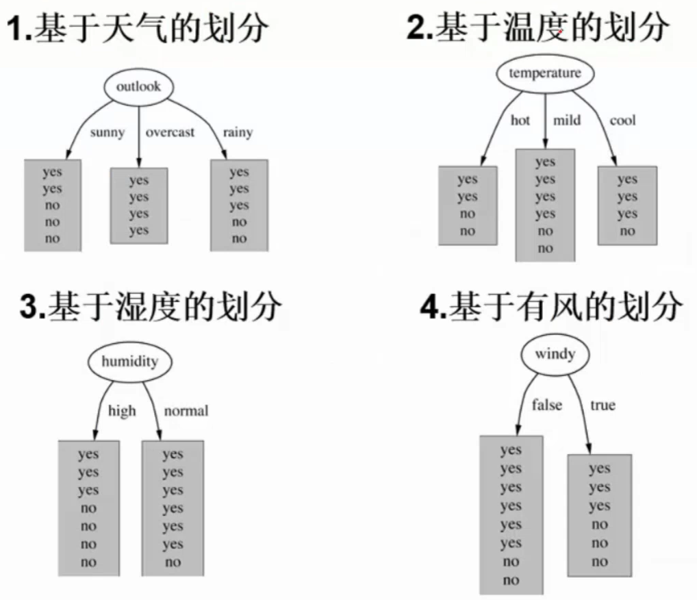

# 人工智能及其应用（蔡自兴）期末复习

>相关资料：
>
>[人工智能期末复习](https://blog.csdn.net/weixin_42859280/article/details/102748907)
>
>[人工智能复习题](https://hwpno1.blog.csdn.net/article/details/102792884)
>
>[人工智能模拟卷](https://hwpno1.blog.csdn.net/article/details/102846753)
>
>[人工智能期末练习题](https://blog.csdn.net/unseven/article/details/116722980)

# 1 :star:绪论

人工智能：人工智能就是用人工的方法在机器（计算机）上实现的智能，或称机器智能、计算机智能。

:star:人工智能发展时期：

- 孕育期 （ 1956年前）：亚里士多德，莱布尼茨，图灵，莫克，麦克洛奇和皮兹，维纳

- 形成期 （ 1956－1970年）：1956年第一次人工智能研讨会（达特茅斯会议），

- 暗淡期 （ 1966－1974年）：过高预言

- 知识应用期 （ 1970－1988年）：专家系统的出现

- 集成发展期 （ 1986年至今）：AI技术进一步研究

:star:人工智能学派：

- 符号主义（功能模拟方法）：逻辑主义，以物理符号系统为原理，代表：纽厄尔，肖，西蒙，尼尔逊（诺艾尔，魈，派蒙，泥鳅）（**诺艾尔**打架溅了一身**泥**，被**魈**卷到天上，突然击中了**派蒙**）
- 连接主义（结构模拟方法）：仿生学派，神经网络之间连接机制为原理，代表：卡洛克，皮茨，霍普菲尔德，鲁梅尔哈特
- 行为主义（行为模拟方法）：控制论学派，类似于控制机器人，代表：布鲁克斯

人工智能应用：问题求解和博弈，逻辑推理和定理证明，计算智能，分布式人工智能和真体，自动程序设计，专家系统，机器学习，自然语言理解，机器人学，模式识别，机器视觉，神经网络，智能控制

人工智能系统分类：专家系统，模糊系统，神经网络系统，学习系统，仿生系统，群智能系统，多真体系统，混合智能系统

目标：

- 近期目标：建造智能计算机代替人类的部分智力劳动
- 远期目标：揭示人类智能的根本机理，用智能机器去模拟、延伸和扩展人类的智能

研究的基本内容：认知建模，知识表示，知识推理，知识应用，机器感知，机器思维，机器学习，机器行为，智能系统构建

# 2 知识表示

## 2.1 :star:状态空间表示

概念理解：状态，算符

**状态表示（知道初始状态和目标状态），状态表示图的画法**

相关问题：

- 野人传教士渡河问题

$(a, b, c)$表示（左岸传教士人数，左岸野人数，左岸船数）

- 梵塔问题

状态：$(S_A, S_B)$，$S_A$表示$A$所在杆号，$S_B$表示$B$所在杆号，$S_A,S_B \in \{1, 2, 3\}$，全部状态为：
$$
(1,1), (1, 2), (1, 3), (2, 1), (2, 2),(2,3),(3,1),(3,2),(3,3)
$$
初始状态：$(1,1)$，目标状态：$(3,3)$

状态空间图：


- 八数码问题


## 2.2 :star:归约表示（与或图）

> 需要理解：归约表示思路，与或图表示

- 梵塔问题（四阶为例）

假设用向量$(D_4, D_{3},D_2, D_1)$表示**从大到小**的圆盘所在的柱子号，则

初始状态：$(1, 1, 1, 1)$

目标状态：$(3, 3, 3, 3)$

问题归约为子问题：

1. 移动3，2，1号圆盘至2号柱子
2. 移动4号圆盘至3号柱子
3. 移动3，2，1号圆盘至3号柱子

归约图表示：


## 2.3 谓词逻辑表示

概念理解：谓词，项，谓词公式，原子公式，合式公式

合式公式性质：


自然语言转换成谓词：

- 人都会死
  $$
  (\forall x) (man(x) \to die(x))
  $$

- 有的人聪明
  $$
  (\exist x) (man(x) \to clever(x))
  $$

谓词推理：

下面的例子使用了$P \lor Q \hspace{1em} \neg P \lor Q \implies Q \lor Q = Q$ 消解推理规则


## 2.4 语义网络表示

常用语义联系：


推理机制：匹配和继承

## 2.5 框架表示

结构：

- 节点
- 槽：每个槽可有多个侧面，每个侧面可有多个值
- 值

推理机制：

- 匹配
- 填槽（查询，默认，继承，附加过程计算）

大学教师的框架：


## 2.6 :star:知识表示方法的联系


# 3 搜索推理

## 3.1 :star:盲目搜索（无信息搜索）

> 本小节没有加以整理，请看课件

- :star:深度优先搜素
- :star:宽（广）度优先搜索
- 等代价搜索（UCS）：就是`Dijkstra`算法
- 有界深搜：就是限制深度的深搜
- 迭代加深算法（IDS）

> 知道OPEN表和CLOSED表的作用

## 3.2 :star:启发式搜索（有信息搜索）

按选择范围不同分为：全局择优搜索（`A,A*`）和局部择优搜素
$$
f(x) = g(x) + h(x)
$$
$h(x)$：启发函数

搜索算法：

- `A`算法：$h(x)$不做限制

- `A*`算法：$h(x)$有限制

## 3.3 :star:消解原理（归结原理）

> 就是对几个子句推导出新的子句（几个公理推导出新的结论）

- :star:如何求子句集（将谓词演算公式化成子句集）P97

> 子句集特征：没有蕴涵词（$\rightarrow$）、等值词（$\leftrightarrow, \equiv$）,$\neg$作用原子谓词，没有全称和存在量词，合取范式，元素之间变元不同，集合形式


- :star:消解推理规则

$$
P \hspace{1em} \neg P \lor Q \implies Q \\
P \lor Q \hspace{1em} \neg P \lor Q \implies Q \lor Q = Q \\
\neg P \hspace{1em} P \implies NIL \\
\neg P \lor R(P \to R) \hspace{1em} \neg Q \lor R(Q \to R) \implies \neg P \lor Q(P \to Q)
$$


- 消解反演

> 消解通过反演来证明。将目标公式否定添加到命题公式集中，从中推导出一个空子句。（类似于反证法，否定结论，并将其作为条件，推导出一个空结论，即不可能满足的结论）

反演树的画法与理解

- 置换与合一的概念

置换：$\sigma = \{f(a) / x , f(y) / z\}$ 代表用$f(a)$代替掉$x$，用$f(y)$代替掉$z$。

合一：寻找一个置换，使两个表达式一致的过程。

## 3.4 规则演绎

- 产生式系统

产生式规则一般形式：

$IF \hspace{1em} A_1,A_2,...,A_n \hspace{1em} THEN \hspace{1em} B$

逻辑蕴含式是产生式的一种特殊形式。

产生式系统的组成：

- 总数据库
- 产生式规则（规则库）
- 控制策略（推理机）

产生式系统的推理：正向推理，逆向推理，双向推理。

## 3.5 不确定性推理

三种不确定性程度：

- 知识不确定性
- 证据不确定性
- 结论不确定性

不确定性表示度量：

- 静态强度：知识的不确定性程度表示，（LS,LN）为知识的不确定性表示。
- 动态强度：证据的不确定性程度表示


### 3.5.1 :star:概率推理

条件概率公式：
$$
P(A|B) = \frac{P(AB)}{P(B)}
$$


全概率公式：（$A_i$构成一个完备事件组，互相独立，其总和为全集）
$$
P(B) = \sum \limits_{i = 1}^n P(A_i)P(B|A_i)
$$


贝叶斯公式：（先验概率$P(H)$，条件概率$P(H|E)$）
$$
P(H|E) = \frac{P(H)P(E|H)}{P(E)} \\
P(B_i | A) = \frac{P(B_i)P(A|B_i)}{\sum_i P(B_i) P(A|B_i)}
$$


### 3.5.2 主观贝叶斯（?）


相关公式：
$$
O(X) = \frac{P(X)}{1 - P(X)} \\
O(H|E) = LS \cdot O(H) \\
O(H| \neg E) = LN \cdot O(H)
$$


### 3.5.3 :star:可信度方法

可信度表示知识或证据的不确定性，范围$[-1,1]$

知识的不确定性表示：

```
if  E  then  H   (CF(H, E)) 
```

`CF(H,E)`：是该条知识的可信度，称为可信度因子或规则强度，它指出当前提条件 E 所对应的证据为真时，它对结论为真的支持程度。


推理结论CF值计算：
$$
CF(H) = CF(H, E) \times max\{0, CF(E) \}
$$
重复结论CF值计算：
$$
if \hspace{1em} E_1 \hspace{1em} then \hspace{1em} H \hspace{1em} (CF(H,E_1)) \\
if \hspace{1em} E_2 \hspace{1em} then \hspace{1em} H \hspace{1em} (CF(H,E_2)) \\
\text{则}
CF_{1,2}(H) = 
\begin{cases}
CF_1(H) + CF_2(H) - CF_1(H) \times CF_2(H) & CF_1(H) \ge 0, CF_2(H) \ge 0 \\
CF_1(H) + CF_2(H) + CF_1(H) \times CF_2(H) & CF_1(H) \lt 0, CF_2(H) \lt 0 \\
\frac{CF_1(H) + CF_2(H)}{1 - min\{ |CF_1(H)|, |CF_2(H)|\}} & CF_1(H),CF_2(H) \text{异号}
\end{cases}
$$


# 4 计算智能

## 4.1 神经计算

神经网络三要素：

- 神经元
  - 为一个简单的线性阈值单元（阈值逻辑单元TLU），简单的单层前馈网络，叫感知器
  - 多个输入通过$f(\sum \limits_{i = 1}^n w_i x_i - \theta)$输出，$f$称为变换函数，$\theta$称为阈值或偏差。

- 网络拓扑结构

  - 递归（反馈）网络（多个神经元之间组成一个互连神经网络）
  - 前馈（多层）网络（神经元之间不存在互连）（代表：BP网络（梯度下降法））

- 学习算法

  - 有师学习算法

  - 无师学习算法（无需知道期望输出）

    - 聚类算法

  - 强化学习算法
    - 遗传算法

感知器逻辑推理：

- 可以解决`AND, OR, NOT`问题
- 不可解决线性不可分问题，例如`XOR`问题
- 但XOR可以使用多层感知器网络（前馈网络）和递归网络实现

## 4.2 模糊计算

### 4.2.1 表示

$$
A = \{ (x, \mu_A(x)) |x \in U \}
$$

$\mu_A(x)$ ：$x$对$A$的隶属度，$\mu_A(x) \in [0, 1]$

表示：

- $X$为离散域
  $$
  F = \sum \limits_{i = 1}^n \mu _F(x) / x \hspace{1em} A = 0/1 + 0.1/2 + 0.5/3 + 0.8 / 4 + 1/5 \\
  \text{或} \\
  F = \{\mu_F(u_1), \mu_F(u_2), \cdots, \mu_F(u_n) \} \hspace{1em} A = \{0, 0.1, 0.5, 0.8, 1 \}
  $$

- $X$ 为连续域
  $$
  F = \int_X \mu_F(x) / x
  $$


### 4.2.2 模糊运算


### 4.2.3 原理（求解过程）

- 模糊化
- 模糊计算：模糊统计法，对比排序法，专家评判法
- 模糊判决（解模糊）：重心法，最大隶属度法，系统加权平均法，隶属度限幅元素平均法

## 4.3 :star:遗传算法

- 是一种模仿生物遗传学和自然选择机理的优化搜索算法，是进化计算的一种重要的形式。有选择算子，交叉算子，变异算子。
- 流程
  - 初始化群体，群体中的每一个个体都是染色体，由二进制串组成，所以算法中会牵扯到编码和解码操作
  - 计算所有个体的适应度（适应度函数由用户自定义，保证适应度大的个体质量更好）
  - 选择：选择方法一般有赌轮选择和联赛选择。赌轮选择：每个个体有一个选择的概率，可以定为个体的适应度除以群体总的适应度，产生随机数选择一个个体。联赛选择：随机选择m个个体，选择适应度最大的个体。选择之后要进行解码操作。
  - 以某一概率进行交叉。（交叉分为一点交叉和两点交叉）
  - 以某一概率进行突变
  - 直至满足某种停止条件，否则一直进行适应度计算往下的操作
  - 输出适应度最优的染色体作为最优解

## 4.4 :star:粒群优化算法（?）

迭代公式

速度更新公式：$v(t + 1) = wv(t) + c_1rand() (p_i - x(t)) + c_2rand()(p_g - x(t))$

> $w$ ：惯性权重，$c_1,c_2$ ：加速常数，$p_i$ ：个体极值，$p_g$ ：全局极值

位置更新公式：$x(t + 1) = x(t) + v(t + 1)$

# 5 机器学习

## 5.1 归纳学习

分为：

- 有师学习（示例学习）
- 无师学习（观察发现学习）

## 5.2 神经网络学习

BP算法：反向传播算法

学习过程：正向传播+反向传播 

## 5.3 深度学习

定义：将神经-中枢-大脑的工作原理设计成一个不断迭代、不断抽象的过程，以便得到最优数据特征表示的机器学习算法

卷积神经网络：

- 神经元之间非全连接
- 同一层神经元之间采用权值共享的方式

优点：

- 采用非线性处理单元组成的多层结构
- 分为有监督学习和无监督学习
- 学习无标签数据优势明显

常用模型：

- 自动编码器：无监督学习
- 受限玻尔兹曼机：学习概率分布的一个随机生成神经网络，限定模型必须为二分图
- 深度信念网络：靠近可视层部分使用贝叶斯信念网络
- 卷积神经网络：多个卷积层和全连接层组成

## 5.4 :star:决策树

> 可参考：https://wyqz.top/p/808139430.html#toc-heading-34

信息熵：
$$
Ent(X) = - \sum p_i log_2 p_i \hspace{2em} \text{i = 1, 2, …, n}
$$
**信息增益：** 表示特征$X$使得类$Y$的不确定性减少的程度（熵值减少），即当前划分对信息熵所造成的变化。

信息增益越大，表示特征a来划分所减少的熵最大，即提升最大，应当作为根节点。
$$
Gain(S, A) = Ent(S) - \sum \limits_{v \in values(A)} \frac{|S_v|}{|S|} Ent(S_v)
$$


**基于信息增益的ID3算法的实例：**

我们有14天的数据，4个特征条件：**天气，温度，湿度，是否有风**。最终结果是去玩不玩。




上面有四种划分方式，我们需要判断谁来当根节点，根据的主要就是信息增益这个指标。下面计算信息增益来判断根节点。

总的数据中，9天玩，5天不玩，熵值为：
$$
-\frac{9}{14}log_2 \frac{9}{14} - \frac{5}{14}log_2 \frac{5}{14} = 0.940
$$
本例暂且以`ent(a, b)`代表以下含义：（只有两种结果的时候的熵值计算）

```python
from math import log2
def ent(a, b):
    tot = a + b
    x, y = a / tot, b / tot
    return -(x * log2(x) + y * log2(y))
```


然后对4个特征逐个分析：

- outlook

  - `outlook = sunny`时，熵值为0.971，取值为sunny的概率为 $\frac{5}{14}$
  - `outlook = overcast`时，熵值为0，取值为overcast的概率为 $\frac{4}{14}$
  - `outlook = rainy`时，熵值为0.971，取值为rainy的概率为 $\frac{5}{14}$

  熵值为：
  $$
  \frac{5}{14} \times 0.971 + \frac{4}{14} \times 0 + \frac{5}{14} \times 0.971 = 0.693
  $$
  信息增益：系统熵值从0.940下降到0.693，增益为0.247。

- temperture

  - `temperture = hot`时，熵值为1.0（`ent(2, 2)`），取值为hot的概率为$\frac{4}{14}$
  - `temperture = mild`时，熵值为0.918（`ent(4, 2)`），取值为mild的概率为$\frac{6}{14}$
  - `temperture = cool`时，熵值为0.81（`ent(3,1)`），取值为cool的概率为$\frac{4}{14}$

  熵值为：
  $$
  \frac{4}{14} \times 1.0 + \frac{6}{14} \times 0.918 + \frac{4}{14} \times 0.81 = 0.911
  $$
  信息增益：$Gain(S, temperture) = 0.940 - 0.911 = 0.029$

$$
Gain(S，Outlook)=0.247  \\
Gain(S, Humidity)=0.151  \\
Gain(S, Wind)=0 .048 \\
Gain(S,Temperature)=0 .029
$$

计算出所有的信息增益之后，选择**有最大的信息增益的特征**作为根节点。

下面找Sunny分支的决策树划分：

总的熵值
$$
-\frac{2}{5} \times log_2(\frac{2}{5}) - \frac{3}{5}log_2(\frac{3}{5}) = 0.97
$$
以剩下的三个特征进行分析：

- temperture

  - temperture=hot，熵值为0，概率为$\frac{2}{5}$
  - temperture=mild，熵值为1.0，概率为$\frac{2}{5}$
  - temperture=cool，熵值为0，概率为$\frac{1}{5}$

  熵值为$\frac{2}{5}$

  信息增益：$0.97-0.4 = 0.57$

- humidy

  - high，熵值为0，概率为$\frac{3}{5}$
  - normal，熵值为1，概率为$\frac{2}{5}$

  熵值为$\frac{2}{5}$

  信息增益：$0.97 - 0.4 = 0.57$

- windy

  - false，熵值为0.918，概率为$\frac{3}{5}$
  - true，熵值为1，概率为$\frac{2}{5}$

  熵值为$0.951$

  信息增益：$0.97 - 0.95 = 0.02$

故选择humidy或wind划分

剩下的划分同理

最终决策树：


