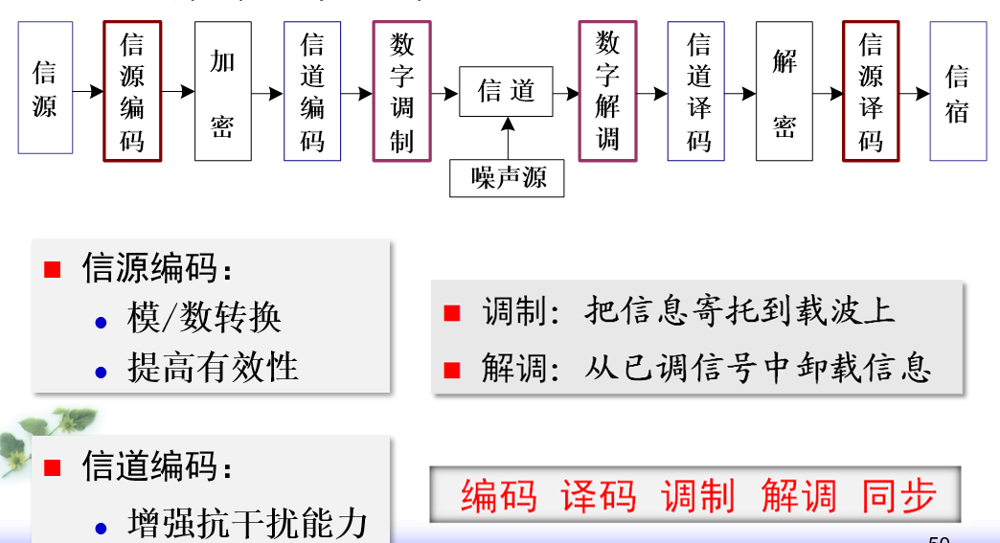
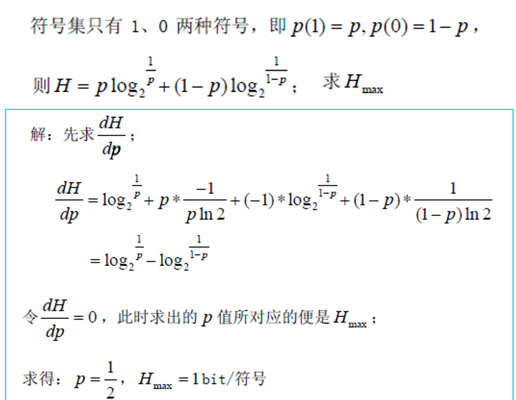
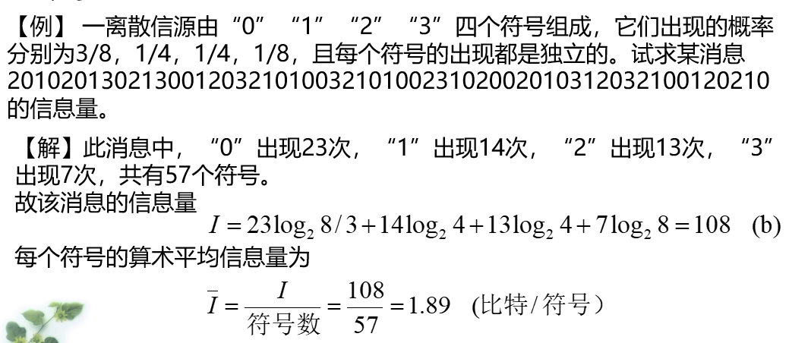
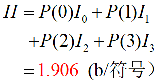
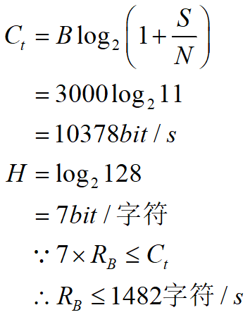

# 物联网无线通信

# 1 概述

物联网产业关注的核心要素：全面感知，可靠传送，智能处理

射频：在空间中进行有效辐射的电磁波频率

微波：经常使用的波段，微波指的是频率300MHz-3000GHz的电磁波

> 微波的频率极高，波长又很短，其在空中的传播特性与光波相近，也就是直线前进，遇到阻挡就被反射或被阻断，因此微波通信的主要方式是**视距通信**，超过视距以后需要中继转发。 

有线通信：串口，USB，网口

无线通信：蜂窝无线连接，WiFi

短距离通信：RFID，NFC（属于RFID中的一种，工作频率13.56MHz），蓝牙（点对点通信，组网能力差），Zigbee，WiFi

> RFID应用：身份证，校园卡，NFC，车钥匙，ETC，防伪，图书

长距离通信：NB-IoT，LoRa

# 2 通信原理

## 2.1 通信的概念

通信：信息**传输**、**处理**和**再现**信息的过程。它涉及信息的发送者、接收者和传输媒体。

> 【雨课堂】
>
> - 通信目的：[传输消息中所包含的信息]
>
> - 信息是消息的 [内涵]，消息是信息的 [表现形式]，信号是消息的 [传输载体] 

模拟信号：取值连续（无穷多）

数字信号：取值离散（有限个）

## 2.2 通信系统的组成

通信系统一般模型：信源，发送设备，信道，接收设备，信宿

发送设备的两大任务：调制和放大

> 将低频的基带信号装载到高频信号上（调制），用天线发送出去

接收设备的三大任务：选频，放大，解调

> 传输中会受到很大的衰减，能量损失较大，需要经过放大器

基带信号：来自信源的消息信号（原始电信号，也称调制信号）

载波信号：未受调制的高频振荡信号

已调信号：受到调制后的已调载波信号

> 【雨课堂】
>
> 调制的目的：
>
> - 将基带信号转换为适合信道传输的信号
> - 便于电磁波辐射接收
> - 便于频分多路复用
> - 提高抗干扰能力

通信系统分类：

- 模拟通信系统

模拟信源，调制器，信道，解调器，信宿

- 数字通信系统

> 【雨课堂】
>
> 数字通信系统的优缺点：
>
> 优点：
>
> - 抗干扰能力强，无噪声积累
> - 便于加密处理
> - 易于实现集成化，使通信设备体积小，功耗低
> - 利于采用时分复用实现多路通信
> - 传输差错可控
> - 便于处理，变换，存储
>
> 缺点：
>
> - 需要较大的传输带宽
> - 对同步要求高

## 2.3 通信系统的分类

按复用方式分为：频分，时分，码分复用

## 2.4 通信方式

按传输方向划分：单工通信，半双工通信，全双工通信

按数字码元传输时序分：并行传输，串行传输

## 2.5 信息及其度量

信息量 $I$ 与消息出现的概率 $P(x)$ 之间的关系为：
$$
I = log_a \frac{1}{P(x)} = - log_a(P(x))
$$

>$a = 2$ 时，信息量的单位是比特（bit）
>
>$a = e$ 时，信息量的单位是奈特（nit）
>
>$a = 10$ 时，信息量的单位是哈特莱

信息源的熵：
$$
H = - \sum \limits _{i = 1} ^n P(x_i) log_2 P(x_i) 
$$

> 当每个符号等概率独立出现时，信源的熵有最大值，单位为`bit/符号`

>【课件例题】
>
>
>$$
>(log_a (x))' = \frac{1}{x ln a}

>$$
>
>
>
>
>【雨课堂】
>
>四进制信源（0，1，2，3），$P(0) = \frac{3}{8}, P(1) = P(2) = \frac{1}{4}, P(3) = \frac{1}{8}$ ，求信源平均信息量
>
>

## 2.6 通信系统的主要性能指标

可靠性：传输的质量问题

有效性：传输的速度问题

- 模拟通信系统：

有效性：用有效传输频带度量

可靠性：用接收端的最终输出信噪比来度量

- 数字通信系统：

有效性：用传输速率和频带利用率来度量

码元传输速率： $R_B = \frac{1}{T}, T:一个码元持续的时间$ 单位为 B（波特）

信息传输速率： $R_b = R_B log_2 M$ 若为二进制信号，`M=2`，八进制信号，`M=8`，单位`bit/s`

>【雨课堂】
>
>二进制传输系统上每秒传输1000个二进制符号，若符号0,1出现的概率分别为1/4、3/4，则该系统的信息传输速率是多少？
>
>符号信息熵为 $H = -\frac{1}{4}log_2{\frac{1}{4}} - \frac{3}{4}log_2{\frac{3}{4}} = 0.811 bit$  `答案是0.415，我不知道为什么`
>
> 符号的传输时间为 $T=1/1000$ 秒
>
>系统的信息传输速率为  $R_b=H/T=811bit/s$

频带利用率： $\frac{R_B}{B} 或 \frac{R_b}{B}$ ，B为带宽

可靠性：用误码率和误信率来度量

误码率 = 传输错误码元数 / 总码元数

误信率 = 错误比特数 / 总比特数

二进制中，两者相等

> 【有例题】请看课件

## 2.7 信息容量

香农公式：
$$
C = B log_2(1 + \frac{S}{N}) \\
eg. \ 30dB = 10lg(\frac{S}{N})
$$

信道容量必须大于等于 $R_b$

> 【有例题】请看课件
>
> 【雨课堂】
>
> 有一显示器终端连接计算机系统，用一条电话线路连接，电话线路带宽3000Hz，信噪比为10dB，终端有128个印刷字符，终端输出字符是相互独立且等概的，求最大的字符速率是？
>
> 

# 3 数字带通传输

## 3.1 概述

方法：

- 模拟调制法
- 数字键控法

## 3.2 二进制数字调制和解调原理

> 【雨课堂】
>
> 2ASK：二进制振幅键控
>
> 2FSK：二进制频移键控
>
> 2PSK：二进制相移键控
>
> 2DPSK：二进制差分相移键控

## 3.3 二进制数字调制系统的性能比较

- 误码率

> 【雨课堂】
>
> - 采用相同解调方式， $r$ （信噪比） 一定，抗高斯白噪声的性能优劣顺序：
>
> 2PSK、2DPSK、2FSK、2ASK（比较误码率）
>
> - 为保证相同的误码率，2ASK、2FSK、2PSK这三种数字调制方式所需的信噪比之间是什么关系？
>
> $r_{2ASK} = 2r_{2FSK} = 4r_{2PSK}$

$r$ 一定，相同的调制方式，误码率：
$$
P_{e相干} \lt P_{e非相干}
$$

- 频带带宽

2FSK对频带利用率最低，有效性最差

- 对信道特性变化的敏感性

>【雨课堂】
>
>对信道特性变化最为敏感：2ASK， $2ASK \gt 2PSK \gt 2FSK$

- 设备复杂度

非相干方式比相干方式简单

## 3.4 多进制数字调制原理和特点

MASK，MPSK，MFSK

> 【雨课堂】 
>
> - 正交振幅调制是一种[振幅]和[相位]联合键控的数字调制技术
>
> - 扩频通信技术：
>
> 根据香农公式可知，在给定的信道容量C不变的情况下，可以通过增加频带宽度的方法，在较低的信噪比（S/N）情况下以相同的信息速率来可靠的传输信息，甚至是在信号被噪声淹没的情况下，只要相应地增加信号带宽，仍然能够保证可靠的通信。 扩展频谱以换取对信噪比要求的降低

