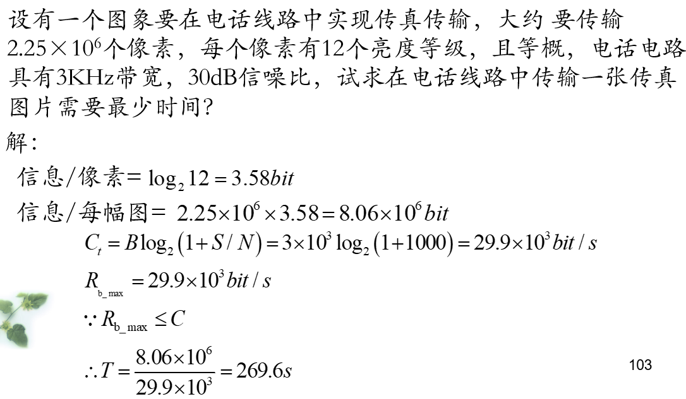

# 物联网无线通信

【王超老师讲授】2023题型：单选（20）填空（20）作图（10）简答（20）综合（30）

# 1 概述

物联网产业关注的核心要素：全面感知，可靠传送，智能处理

射频：在空间中进行有效辐射的电磁波频率

微波：经常使用的波段，微波指的是频率300MHz-3000GHz的电磁波

> 微波的频率极高，波长又很短，其在空中的传播特性与光波相近，也就是直线前进，遇到阻挡就被反射或被阻断，因此微波通信的主要方式是**视距通信**，超过视距以后需要中继转发。 

有线通信：串口，USB，网口

无线通信：蜂窝无线连接，WiFi

短距离通信：RFID，NFC（属于RFID中的一种，工作频率13.56MHz），蓝牙（点对点通信，组网能力差），Zigbee，WiFi

> RFID应用：身份证，校园卡，NFC，车钥匙，ETC，防伪，图书

长距离通信：NB-IoT，LoRa :star:

# 2 通信原理

## 2.1 通信的概念

通信：信息**传输**、**处理**和**再现**信息的过程。它涉及信息的发送者、接收者和传输媒体。

> 【雨课堂】
>
> - 通信目的：[传输消息中所包含的信息]
>
> - 信息是消息的 [内涵]，消息是信息的 [表现形式]，信号是消息的 [传输载体] 

模拟信号：取值连续（无穷多）

数字信号：取值离散（有限个）

## 2.2 通信系统的组成

:rocket: 通信系统一般模型：信源，发送设备，信道，接收设备，信宿 :rocket:

发送设备的两大任务：调制和放大

> 将低频的基带信号装载到高频信号上（调制），用天线发送出去

接收设备的三大任务：选频，放大，解调

> 传输中会受到很大的衰减，能量损失较大，需要经过放大器

:bell: 基带信号：来自信源的消息信号（原始电信号，也称调制信号）

:bell: 载波信号：未受调制的高频振荡信号

:bell: 已调信号：受到调制后的已调载波信号

> 【雨课堂】
>
> 调制的目的：
>
> - 将基带信号转换为适合信道传输的信号
> - 便于电磁波辐射接收
> - 便于频分多路复用
> - 提高抗干扰能力

通信系统分类：

- 模拟通信系统

模拟信源，调制器，信道，解调器，信宿

- :star: 数字通信系统 :star:

> 【雨课堂】
>
> 数字通信系统的优缺点：
>
> 优点：
>
> - 抗干扰能力强，无噪声积累
> - 便于加密处理
> - 易于实现集成化，使通信设备体积小，功耗低
> - 利于采用时分复用实现多路通信
> - 传输差错可控
> - 便于处理，变换，存储
>
> 缺点：
>
> - 需要较大的传输带宽
> - 对同步要求高

## 2.3 通信系统的分类

按复用方式分为：频分，时分，码分复用

## 2.4 通信方式

按传输方向划分：单工通信，半双工通信，全双工通信

按数字码元传输时序分：并行传输，串行传输

## 2.5 信息及其度量

:star: 信息量 $I$ 与消息出现的概率 $P(x)$ 之间的关系为： :star:
$$
I = log_a \frac{1}{P(x)} = - log_a(P(x))
$$

>$a = 2$ 时，信息量的单位是比特（bit）
>
>$a = e$ 时，信息量的单位是奈特（nit）
>
>$a = 10$ 时，信息量的单位是哈特莱

:star: 信息源的熵： :star: 
$$
H = - \sum \limits _{i = 1} ^n P(x_i) log_2 P(x_i)
$$

> 当每个符号等概率独立出现时，信源的熵有最大值，单位为`bit/符号`

>【课件例题】
>
>
>$$
>(log_a (x))' = \frac{1}{x ln a}
>$$

>
>
>
>【雨课堂】
>
>四进制信源（0，1，2，3），$P(0) = \frac{3}{8}, P(1) = P(2) = \frac{1}{4}, P(3) = \frac{1}{8}$ ，求信源平均信息量 :yum: 
>
>

## 2.6 通信系统的主要性能指标

可靠性：传输的质量问题

有效性：传输的速度问题

- 模拟通信系统：

有效性：用有效传输频带度量

可靠性：用接收端的最终输出信噪比来度量

- 数字通信系统：

有效性：用传输速率和频带利用率来度量

:heart: :heart: :heart:

码元传输速率： $R_B = \frac{1}{T}, T:一个码元持续的时间$ 单位为 B（波特）

信息传输速率： $R_b = R_B log_2 M$ 若为二进制信号，`M=2`，八进制信号，`M=8`，单位`bit/s`

:heart: :heart: :heart:

>【雨课堂】
>
>二进制传输系统上每秒传输1000个二进制符号，若符号0,1出现的概率分别为1/4、3/4，则该系统的信息传输速率是多少？
>
>符号信息熵为 $H = -\frac{1}{4}log_2{\frac{1}{4}} - \frac{3}{4}log_2{\frac{3}{4}} = 0.811 bit$  
>
> 符号的传输时间为 $T=1/1000$ 秒
>
>系统的信息传输速率为  $R_b=H/T=811bit/s$

频带利用率： $\frac{R_B}{B} 或 \frac{R_b}{B}$ ，B为带宽

可靠性：用误码率和误信率来度量

误码率 = 传输错误码元数 / 总码元数

误信率 = 错误比特数 / 总比特数

二进制中，两者相等

> 【例题】
>
> 
>
> 
>
> 

## 2.7 信息容量

:bus: 香农公式 :bus:
$$
C = B log_2(1 + \frac{S}{N}) \\
eg. \ 30dB = 10lg(\frac{S}{N})
$$

:star: 重要条件：信道容量 $C$ 大于等于 $R_b$ :star:

> 【例题】
>
> 
>
> 
>
> 【雨课堂】
>
> 有一显示器终端连接计算机系统，用一条电话线路连接，电话线路带宽3000Hz，信噪比为10dB，终端有128个印刷字符，终端输出字符是相互独立且等概的，求最大的字符速率是？
>
> 

# 3 数字带通传输

## 3.1 概述

方法：

- 模拟调制法
- 数字键控法

## 3.2 二进制数字调制和解调原理

> 【雨课堂】:+1:
>
> 2ASK：二进制振幅键控
>
> 2FSK：二进制频移键控
>
> 2PSK：二进制相移键控
>
> 2DPSK：二进制差分相移键控

## 3.3 二进制数字调制系统的性能比较

- 误码率

> 【雨课堂】 :pray: :pray: :pray:
>
> - 采用相同解调方式， $r$ （信噪比） 一定，抗高斯白噪声的性能优劣顺序：
>
> 2PSK、2DPSK、2FSK、2ASK（比较误码率）
>
> - 为保证相同的误码率，2ASK、2FSK、2PSK这三种数字调制方式所需的信噪比之间是什么关系？
>
> $r_{2ASK} = 2r_{2FSK} = 4r_{2PSK}$

$r$ 一定，相同的调制方式，误码率：
$$
P_{e相干} \lt P_{e非相干}
$$

- 频带带宽

2FSK对频带利用率最低，有效性最差

- 对信道特性变化的敏感性

>【雨课堂】 :pray: :pray: :pray:
>
>对信道特性变化最为敏感：2ASK， $2ASK \gt 2PSK \gt 2FSK$

- 设备复杂度

非相干方式比相干方式简单

## 3.4 多进制数字调制原理和特点

$M$ 进制， 每个码元携带 $log_2 M \ bit$ 信息 
$$
R_b = R_B log_2 M
$$

:heart: 目的：提高信道的频带利用率 :heart:

MASK，MPSK，MFSK（MFSK信号带宽较宽，频带利用率低）

> 【雨课堂】 
>
> - 正交振幅调制（QAM）是一种[**振幅**]和[**相位**]联合键控的数字调制技术
>
> - Zigbee和LoRa均采用了扩频通信实现抗干扰和远距离的信息传输，试结合香农定理解释为什么扩频通信可以实现抗干扰和远距离的通信。
>
>
> 扩频通信技术：根据香农公式可知，在给定的信道容量C不变的情况下，可以通过增加频带宽度的方法，在较低的信噪比（S/N）情况下以相同的信息速率来可靠的传输信息，甚至是在信号被噪声淹没的情况下，只要相应地增加信号带宽，仍然能够保证可靠的通信。 扩展频谱以换取对信噪比要求的降低。

# 4 天线与电波传输

## 4.1 无线电波基本知识

无线电波是一种能量传递的形式

无线电波的参数：波速度，波长，极化方式（电场强度E的矢端在空间固定点上随时间的变化所描绘的轨迹。）
$$
\lambda = VT = \frac{V}{f}
$$

极化方式：

- 线极化（电场强度矢量端点的轨迹是一条直线）
  - 水平极化（场方向与地面平行）
  - 垂直极化（场方向与地面垂直）
- 圆极化
- 椭圆极化

> 【雨课堂】
>
> - 收发信号要求极化相同。
>
> 若发射天线采用垂直极化，则接收天线一般情况下应采用**垂直极化**。
>
> - :star: 什么是电磁波的极化：**电场强度E的矢端在空间固定点上随时间的变化所描绘的轨迹**
> - 垂直极化波的电场方向与地面**垂直**，水平极化波的电场方向与地面**平行**
> - 电磁波的波长与频率成**反比例**

## 4.2 天线基本知识

天线：能够进行能量转换即有效地辐射和接收电磁波的装置

天线必须解决的三个问题：

- 提高辐射功率或信噪比
- 具有向所需方向辐射电磁波的能力
- 中、收、发天线应有相同的极化形式

天线导波原理：载有交流电的导线，其辐射能力与导线的长短和形状有关

将能产生显著辐射的直导线称为振子

振子类型：

- 对称振子：两臂长度相等的振子
- 半波振子：每臂长度为**四分之一**波长
- 全波对称振子：全长与波长相等

> 【雨课堂】
>
> 半波振子天线每臂的长度为波长的 [四] 分之一

双极化天线比单极化天线接受范围更大，损失小，效果更好

天线的方向性的特性曲线通常用**天线方向图**来表示。

天线增益：在输入功率相等的条件下，实际天线与理想的辐射单元在空间同一点处所产生的信号的功率密度之比。

天线的工作频率范围：工作在中心频率时天线所能输送的功率最大，偏离中心频率时它所输送的功率都将减小

RF功率单位：W（绝对功率）

分贝（dB）是用于测量两个信号相对强度（比率）的单位

> dBm是相对于1mW的强度

:star: 转换等式：
$$
x(dbm) = 10 lg \ y(mW) \\
y(mW) = 10 ^{x(dBm) / 10}
$$

>【雨课堂】
>
>- 某无线通信模块的发射功率和接收灵敏度分别为12dBm和-132dBm ，将上述功率转换为mW
>
>$$
>10 ^ {12 / 10} = 15.8 mW\\
>10 ^ {-132 / 10} = 6.3 \times 10 ^ {-14} mW
>$$
>
>- 某同学需要选择一个 **天线** 用于蓝牙通信系统，他应该关注天线的哪些参数？
>
>1.极化方式
>
>2.工作频率范围
>
>3.天线方向图
>
>4.天线增益

## 4.3 电波传播特性

电波传播方式：直射波，反射波，绕射波，散射波

自由空间传播：均匀无损耗的无限大空间，其电波传播具有**各向同性**

自由空间特点：电波传播时能量不会被障碍物吸收、反射、散射而产生损耗

自由空间损耗的根本原因：能量扩散

> 球面波在传播过程中，随着传播距离增大，球面单位面积上的能量减小了，而接收天线的有效截面积是一定的，因而接收天线所捕获的信号功率减小了，这就是自由空间损耗。

自由空间传播损耗：
$$
L_{fs}(dB) = 32.44 + 20 lg \ d (Km) + 20 lg \ f(MHz)
$$
结论：自由空间中电波传播损耗只与工作频率和传播距离有关。

自由空间传播适用范围：只要地面上空的大气层是**各向同性的均匀媒质**，其传播路径上没有障碍物的阻挡，到达接收天线的地面反射信号场强也可以忽略不计，这样情况下，电波可视作在自由空间中传播。

接收功率
$$
P_R(dBm) = P_T(dBm) + G_T(dB) + G_R(dB) - L_{fs}(dB)
$$

> 【例题】
>
> 
>
> 
>
> 【雨课堂】
>
> 
> $$
> P_R = -150 \\
> L_{b} = 套公式 \\
> P_R(dBm) = P_T(dBm) + G_T(dB) + G_R(dB) - L_{b}(dB) \\
> 可以求出 P_T
> $$
>
> - 室内环境下，电波传播距离很近时，传输损耗非常接近自由空间的情况，其计算公式为：
>
> $$
> L_{fs}(dB) = 32.44 + 20 lg \ d(kM) + lg f(MHz)
> $$
>
> 试计算某2.4GHz信号，在距离分别为d=1m，d=2m，d=5m时的传播损耗。
>
> 带公式就行

# 5 蓝牙通信技术

## 5.1 蓝牙技术的概论

蓝牙技术：一种近距离的保证可靠接收和信息安全的无线通信技术

蓝牙芯片可满足：

- 在10m范围内实现一点对多点的通信；

- 满足一定的数据传输速率；

- 使用频段2.4GHz；

- 要求成本低廉，价格与所取代的电缆线基本持平。

> 【雨课堂】
>
> - :rocket: 蓝牙工作频率为[2.4GHz] :rocket: 
> - 蓝牙通信技术的特点：
>   - 全球范围适用
>   - 可建立临时对等连接
>   - 很好的抗干扰能力和安全性
>   - 功耗低，体积小
>   - 近距离通信
>   - 同时传输语音数据

## 5.2 蓝牙技术协议体系结构

蓝牙协议采用分层结构，遵循OSI参考模型。

> OSI模型：应用层，表示层，会话层，传输层，网络层，数据链路层，物理层

蓝牙协议体系可分为：底层协议，中间层协议，高端应用层协议

底层协议：射频（RF）协议，基带（BB）协议，链路管理协议（LMP）

>射频(RF)协议：主要定义频段与信道安排、发射/接收机特性等
>
>基带(BB)协议：为基带数据分组提供同步定向连接(Synchronous  Connection Orented，SCO)和异步无连接(Asynchronous  Connectionless，ACL)两种物理链路，对不同数据类型都会分配一个 特殊信道，用于传递连接管理和控制信息等
>
>链路管理协议(LMP)：主要负责蓝牙设备间连接的建立、拆除和安全控制，控制无线设备的节能模式和工作周期，以及微微网内各设备单元的连接状态。

---

中间层协议：:interrobang:

:one: 主机控制器接口(HCI)协议：位于L2CAP和LMP之间，为上层协议提供进入LMP和BB的统一接口和方式。HCI传输层包括：USB、RS232、UART和PC 卡。

:two: 逻辑链路控制与适配协议(L2CAP)：主要完成数据的拆装、服务质量控制，协议的复用、分组的分割和重组及组管理等功能。

:three: 串口仿真协议(RFCOMM)：又称线缆替换协议，仿真RS-232的控制和数据信号，可实现设备间的串行通信，为使用串行线传送机制的上层协议提供服务。

:four: 电话控制协议(TelCtrl)：包括电话控制规范二进制(TCS-BIN)协议和A/T命令集电话控制命令。

:five: 服务发现协议(SDP)：为上层应用程序提供一种机制来发现可用的服务，是所有用户模式的基础。

蓝牙设备主要运行在**待机和连接**两种状态。

> 待机：蓝牙默认的工作状态，每隔1.28s周期性侦听信息，一旦被唤醒，就处于连接状态
>
> 连接：连接建立后，可处于激活，保持，呼吸，休眠4种模式，功耗由低到高为休眠，保持，呼吸
>
> 【雨课堂】
>
> 蓝牙设备连接后，处于哪种状态功耗最低？
>
> 休眠状态

:heart: 蓝牙的网络结构：微微网（个人局域网），散射网 :heart:

微微网是蓝牙基本的组网方式，散射网由多个微微网组成

同一个微微网中：

- 一个蓝牙设备可以同时与最多 $7$ 个其他蓝牙设备相连

- 各单元之间共享一个信道

- 有且只有一个主单元，其余为从单元

- 主单元控制微微网从建立到数据传送到最后结束通信的整个过程

## 5.3 蓝牙网络结构 :heavy_check_mark:

微微网：1台主设备和1台以上从设备构成的网络称为微微网

> 在一个微微网中最多可有七个活动**从设备**。另外，更多的**从设备**被锁定在休眠状态中。在同一个微微网中，主设备为所有的从设备提供时钟和跳频同步序列。
>
> 在同一个微微网中，所有的设备有同样的跳频序列。
>
> 【雨课堂】
>
> 一个蓝牙微微网的主设备，最多可以连接 [七] 个处于活动状态的从设备。

微微网中，所有设备的级别是相同的，具有相同的权限

每个微微网都有独立的跳频序列，微微网间不会发生跳频同步，无同频干扰。

散射网：散射网是由多个独立的非同步的微微网组成的，比单一微微网覆盖更多设备，更大范围

- 一个设备不能同时担任两个微微网的主设备。

- 不同微微网之间有互联的桥接设备，桥接设备可以由主设备或从设备充当。

## 5.4 蓝牙模块

目前多数蓝牙芯片底层硬件采用单芯片结构

蓝牙模块：在蓝牙芯片的基础上，添加天线、晶振、电源电路等，并根据应用需求开发所需的应用协议、应用程序和接口驱动程序，即可构成蓝牙模块

蓝牙性能指标：发射功率，接受灵敏度，通信距离，功耗与电流

模块主要特点：

- 支持主从一体（主从可通过硬件和AT指令切换）
- 内置SPI编程接口

蓝牙串口模块：发送端TXD连接另一台设备的接收端RXD

> 【雨课堂】
>
> 蓝牙串口模块与USB转TTL模块电气连接后并与上位机相连，如果在串口调试助手的发送界面输入“AT”后没有反馈“OK”，则可以尝试使用哪些步骤解决该问题？
>
> (1) 检查硬件连接，即蓝牙模块的TXD是否与USB转TTL模块的RDX进行连接，蓝牙模块的RDX是否与USB转TTL模块的TXD进行连接。
>
> (2) 检查USB转TTL模块的驱动是否正确安装，PC端的操作系统是否能正确识别连接的端口号。
>
> (3) 检查串口调试小助手的端口号是否设置正确，是否单击了“打开串口”按钮。
>
> (4) 串口调试小助手的命令栏内的“AT”后面是否加“回车”按键。

## 5.5 蓝牙应用开发

AT指令：早期AT指令多用于GSM、GPRS模块

蓝牙模块和WiFi模块支持AT指令

AT指令分为**下行命令和上行命令**，下行命令是PC发给模块的，上行命令是模块上报给PC的。

## 5.6 蓝牙应用领域

数据传输领域：鼠标，键盘，打印机

语音传输领域：蓝牙耳机，蓝牙音响，蓝牙麦克风

医疗保健领域：检测设备（血压，心率），手环

智能家居领域：灯光，窗帘，智能开关，智能插座

# 6 WiFi通信技术

## 6.1 WiFi技术简介

>【雨课堂】
>
>- 一般而言，5GHz频段的WiFi信号对于障碍物的穿透能力 [弱] 于2.4GHz频段的WiFi信号， 5GHz频段WiFi信号的数据传输速率 [强]于2.4GHz频段的WiFi信号
>
>- 一个双频无线路由器有4个天线，其中 [2] 个天线很可能工作于2.4GHz频段，其中 [2]个天线很可能工作于5GHz频段

WLAN是利用射频无线信道或红外信道取代有限传输介质所构成的局域网络。

按照频段划分可分为：专用频段和自由使用频段

> 专用频段：需要经过批准缴纳相关费用的独自使用频段
>
> 自由使用频段：工业科研医疗不需执照的频段

覆盖范围：几十米到几千米

两个标准：IEEE 802.11系列标准（IEEE 802.11b是目前的主流标准），HiperLAN系列标准

## 6.2 WiFi系统组成 :heavy_check_mark:

网络拓扑结构：基础网（Infrastructure）和自组网（Ad-hoc）

:star: 重要概念：

站点（STA）：网络中最基本的组成部分，每一个连接到无线网络中的终端

无线接入点（AP）：无线网络的创建者，也是网络的中心节点

> 【雨课堂】
>
> WiFi基础网的特点：
>
> 1. 基于AP组建的基础无线网络
> 2. 由AP创建，众多STA加入所组成
> 3. AP是整个网络的中心
> 4. 各STA间不能直接通信，需经AP转发

WiFi基础网络的基本元素：BSS（基本服务集）

基本服务集中有服务集识别码SSID

> 【雨课堂】
>
> 自组网的特点：
>
> 1. 仅由两个及以上STA组成，网络中不存在AP。
>
> 2. 各设备自发组网，设备之间是对等的。
> 3. 网络中所有的STA之间都可以直接通信，不需要转发。
> 4. Ad-hoc模式也称为对等模式，允许一组具有无线功能的计算机或移动设备之间为数据共享而迅速建立起无线连接。

WiFi协议架构：与蓝牙一样，遵循OSI模型

## 6.3 WiFi信道

- **信道**也称作通道、频段，是以无线信号作为传输载体的数据信号传送通道。

- **无线**信道不是独占的，而是所有通信中的AP公用的。
- 相同信道上工作的AP会降低吞吐量
- IEEE802.11n就是在IEEE802.11g的基础上，把马路的宽度增加一倍，同时又缩短了前后车辆的车距，才获得了更高的数据吞吐量。

2.4GHz信道划分：

- 每个信道带宽为22MHz，其中有效宽度是20MHz，另外还有2MHz的强制隔离频带。
- 相邻的信道间有重叠，尽量不要同时使用，以免造成干扰
- 1-13个信道的中心频率： $ 2412+(n-1)*5MHz$

>【雨课堂】:zap: :zap: :zap:
>
>3个不重叠的信道：1、6、11；2、7、12；3、8、13

- 2.4GHz频段由于使用ISM频段，干扰较多。

- 目前很多WiFi设备开始使用5.8GHz附近（5.725~5.850GHz）的频带，可用带宽为125MHz。

- 该频段共划分为5个信道，每个信道宽度为20MHz，每个信道与相邻信道都不发生重叠，因而干扰较小。

- 缺点：5.8GHz频率较高，在空间传输时衰减较为严重。如果距离稍远，性能会严重降低。

## 6.4 WiFi网络安全机制

安全性主要包括访问控制和加密两大部分

WiFi的网络安全机制有认证和加密两种

典型的认证加密机制有：Open System，WPA/WPA2，WPS，WEP等

Open System：不认证也不加密，任何人都可以连接到无线基地台使用网络

WEP（有线等效加密）：最基本的加密技术，有64位秘钥和128位秘钥两种加密方式

WPA（WiFi保护访问）：替代传统的WEP安全技术

WPA2：是WPA的加强版，更难破解，更安全

>【雨课堂】
>
>WPA、WEP 、 WPA2这三种安全机制的安全性从高到低的排序依次为 【WPA2,WPA,WEP】

## 6.5 WiFi模块

## 6.6 WiFi应用开发

透明数据传输模式又称自动工作模式，WiFi模块可以看做是一条虚拟的串口线。

命令工作模式下，用户可以通过串口下发AT指令，实现对模块的完全控制。

# 7 ZigBee通信技术

## 7.1 ZigBee技术概述

- :fire: 基于IEEE 802.15.4协议 :fire:
- 一种无线自组网技术标准

特点：

1.响应速度快、时延短

2.安全、可靠

3.低功耗、低成本

4.网络容量大

5.传输速率低

> 【雨课堂】
>
> - ZigBee在世界范围内的工作频段为 [2.4GHz] ，在美国的工作频段为 [915MHz] ，在欧洲的工作频段为 [868MHz] 。
> - ZigBee的自组织功能：无需人工干预，网络节点能够感知其他节点的存在， 并确定连接关系，组成结构化的网络。
> - ZigBee的自愈功能：增加或删除一个节点，节点位置发生变动，节点发生故障等等，网络都能够自我修复，并对网络拓扑结构进行相应地调整，无需人工干预，保证整个系统仍然能正常工作。

ZigBee的自组织、自愈能力强

## 7.2 ZigBee协议栈

从下往上依次是物理层，MAC层，网络层，应用层

ZigBee的网络地址：1个是64位的IEEE地址，通常叫做MAC地址或扩展地址，另一个是16位的网络地址（设备加入ZigBee网络才分配，在整个网络中唯一，用于收发数据地址的识别），叫逻辑地址或短地址。

采用Z-Stack协议栈，采用操作系统的思想来构建，可以极大降低系统功耗

## 7.3 ZigBee的网络拓扑结构 :heavy_check_mark:

网络协调器：每个ZigBee网络必须有一个初始化网络信息

>【雨课堂】
>
>- 全功能设备（FFD）：可以担任网络协调者，形成网络，让其它的FFD或是精简功能装置（RFD）连结，FFD具备控制器的功能，可提供信息双向传输。附带有限的功能来控制成本和复杂性。在网络中通常用作终端设备。
>- 精简功能设备（RFD）：只能传送信息给FFD或从FFD接受信息。附带有限的功能来控制成本和复杂性。在网络中通常用作终端设备。

全功能器件：FFD=RFD+Router，可工作于所有网络结构，可作为网络协调器，可与网络中任何节点通信

简化功能器件：RFD，仅可和网络中的FFD通信，不能作为网络协调器

节点类型：

- 协调器节点
- 路由器节点
- 终端节点

>【雨课堂】
>
>ZigBee的网络拓扑结构有哪些？分别有什么特点？
>
>拓扑结构类型：
>
>- 星型结构：最简单的一种拓扑形式；包含一个协调器结点和一系列的终端节点。但是协调器结点故障将致使整个网络瘫痪。
>- 树状结构：可实现网络范围内多跳信息服务。具有一定的稳定性和可扩展性。不能很好适应外部动态环境；任意节点中断或故障将会使部分节点脱离网络。
>- 网状结构：具有自组织，自愈的功能。 具有更加灵活的信息路由规则。实现复杂。

## 7.4 ZigBee网络的组建

协调器功能特点：

- 选择一个频道和PAN ID，组建网络
- 允许路由和终端节点加入网络
- 对网络中的数据进行路由
- 常供电，不能进入睡眠模式
- 可以为睡眠的终端节点保留数据，等他唤醒后获取

>   协调器在选择频道和PAN ID组建网络后，其功能将相当于一个路由器。

路由器的功能特点：

- 进行数据收发之前，必须先加入一个Zigbee网络

- 本身加入网络后，允许路由和终端节点加入

- 加入网络后，可以对网络中的数据进行路由

- 必须常供电，不能进入睡眠模式

- 可以为睡眠的终端节点保留数据，至其唤醒后获取

**终端节点的功能特点：**

- 在数据收发之前，必须首先加入一个Zigbee网络

- 不能允许其它设备加入

- 必须通过其父节点收发数据，不能对网络中的数据进行路由

- 可由电池供电，进入睡眠模式

PAN ID：

- PAN的全称为Personal Area Network，即个域网。

- 每个PAN都有一个独立的ID，即为PAN ID。

- 整个个域网中的所有设备共享同一个PAN ID。

- Zigbee设备的PAN ID可以通过程序预先指定，也可以在设备运行期间自动加入到附近的一个PAN中

ZigBee设备地址类型：16位短地址，64位IEEE地址

16位短地址：16位短地址是在设备加入一个Zigbee网络时分配的，它只在整个网络中唯一，用于网络内数据收发时的地址识别。

64位IEEE地址：64位地址是全球唯一的地址，在设备的整个生命周期内都将保持不同

在任何一个PAN中，短地址0x0000都是协调器，一个新设备加入网络中，会生成一个随机短地址，然后向网络中广播，如果出现冲突，整个网络将全部更换地址，直至没有冲突。加入网络后，终端节点回周期性发送数据请求，如果父节点没有响应，则判定父节点丢失，则会重复上述过程，直至加入网络。

数据收发方式：

- 单播
- 广播

# 8 LPWAN技术

## 8.1 LPWAN简介

> 【雨课堂】
>
> 什么是LPWAN，有哪些业务特点？
>
> LPWAN即低功耗广域网。
>
> 其业务特点为：
>
> 1. 低速率低流量
> 2. 低功耗
> 3. 广覆盖
> 4. 低成本
> 5. 超大连接

根据传输速率的不同，可以分为高中低速：

高速率业务：主要使用4G,5G技术

中速率业务：主要是用GPRS技术

低速率业务：主要为LPWAN

## 8.2 NB-IOT通信技术

> 【雨课堂】
>
> NB-IOT技术的优缺点：
>
> **优点：**NB-IoT在覆盖、功耗、成本、连接数等⽅⾯性能优异;
>
> **缺点：**NB-IoT⽆法满⾜对移动性及速率要求较⾼、数据量⼤、需要语⾳业务的应⽤需求，可考虑eMTC、Cat1等候选技术;

NB-IOT不支持切换功能，它的应用场景都是低移动性的。

网络部署：主要部署在低频频段

- 独立部署
- 保护带部署
- 带内部署

NB-IOT网络构架：

- NB-IOT终端：空口接入基站
- eNodeB节点：承担空口接入，与核心网相连
- 核心网：将IOT相关数据转发至IOT平台处理
- IOT平台：汇聚各种接入网的数据，转发至业务层处理
- 应用服务器

蜂窝物联网 CIOT：

- 窄带物联网NB-IOT
- 宽带物联网
  - FDD eMTC/cat1/4
  - TDD eMTC/cat1/4

> 【雨课堂】
>
> 5G、LTE-M 、NB-IOT 、LoRa这四种无线通信技术的移动性如何？
>
> 5G的移动性大致为：<500Km/h
>
> LTE-M的移动性大致为：<350Km/h
>
> NB-IOT的移动性大致为：<30Km/h
>
> LoRa的移动性大致为：<30Km/h

NB-IOT应用：共享单车

## 8.3 LoRa通信技术

标准：IEEE 802.15.4g

LoRa网络主要由终端（内置LoRa模块）、网关（或称基站）、网络服务器以及应用服务器组成。应用数据可双向传输

> 【雨课堂】
>
> 简述LoRa的网络架构：
>
>  LoRa网络架构是一个典型的星形拓扑结构，在这个网络架构中，LoRa网关是一个透明传输的中继，连接终端设备和后端中央服务器。终端设备采用单跳与一个或多个网关通信。所有的节点与网关间均是双向通信。

LoRa可以实现自动中继组网：可以多个网络同时运行，只需供电即可，无需其他控制单元，适合超远距离组网通信。

> 【雨课堂】 :pray: :pray: :pray:
>
> LoRa终端设备的Class A, Class B, Class C模式分别有什么特点？ 
>
> Class A：节点按需主动上报数据，每一个终端上行传输后会伴随着两个下行接收窗口，平时休眠，只有在固定的窗口期才能接收网关下行数据。Class A的优势是功耗极低。
>
> Class B：ClassB模式是固定周期时间同步，在固定周期内可以随机确定窗口期接收网关下行数据，兼顾实时性和低功耗，特点是对时间同步要求很高
>
> Class C：该模式是常发常收模式，节点不考虑功耗，随时可以接收网关下行数据，实时性好，适合不考虑功耗或需要大量下行数据控制的应用，比如智能路灯控制。

## 8.4 NB-IOT与LoRa对比

>【雨课堂】 :pray: :pray: :pray:
>
>- 试从运营模式、建设及运营成本 、模组功耗 、 覆盖深度、覆盖地区这５个层面上比较NB－IOT技术与LoRa技术
>
>运营模式：NB是运行商建网，LoRa是企业自建网
>
>建设及运营成本：NB属于运营商建网，用户需要承担的是NB模组硬件成本+NB运营商网络租用成本。LoRa属于自建网，用户需要承担LoRa模组成本+LoRa基站成本；NB的成本比LoRa高20-30%左右
>
>模组功耗：NB的功耗当前比LoRa要高，但具体对比与终端数据接收及发射频率有很大关系
>
>覆盖深度：NB是公用网络，能保证大部分终端可用，少部分终端不太可能深度覆盖；LoRa是私网，每台基站费用几千，覆盖深度可控
>
>覆盖地区：NB属于运营商建网，运营商考虑其效益因素，会更多地考虑在人口密集区域，如一二三四线城市，尤其是市区人口密集区做重点覆盖；那么在人口稀疏地区至少在当前阶段不是重点；LoRa做为私网建设，则不受此影响
>
>- 试举例说明哪些应用适合采用NB-IOT技术，哪些应用适合采用LoRa技术，并分别说明原因。
>
>适合NB的应用：
>
>（1）共享单车：分布广，单位密度小，适合借助运营商网络；
>
>（2）智能抄表：业主对采集频率不高，对网络可用性没有高要求的，又不想考虑自建基站；
>
>（3）积水/管网监测：分布广，单位密度小；
>
>（4）通用型可穿戴系列：终端分布在整个城区，适合借助运营商网络；
>
>（5）智能停车：地磁来感应磁场变化从而进行车辆出入车位的判断，上下行的无线链路采用NB-IoT标准。
>
>适合LoRa的应用
>
>（1）智能抄表：业主对采集频率有高要求需要做数据分析，对网络可用性有高要求；
>
>（2）道路泊车检测器：采集频率较高，而对终端寿命又有一定要求；
>
>（3）野外郊区的，如矿业、采掘业、郊区重工业等；
>
>（4）区域集中型：如高校、普教、园区的用户，想建设私网对自己的设施及应用进行管理。

