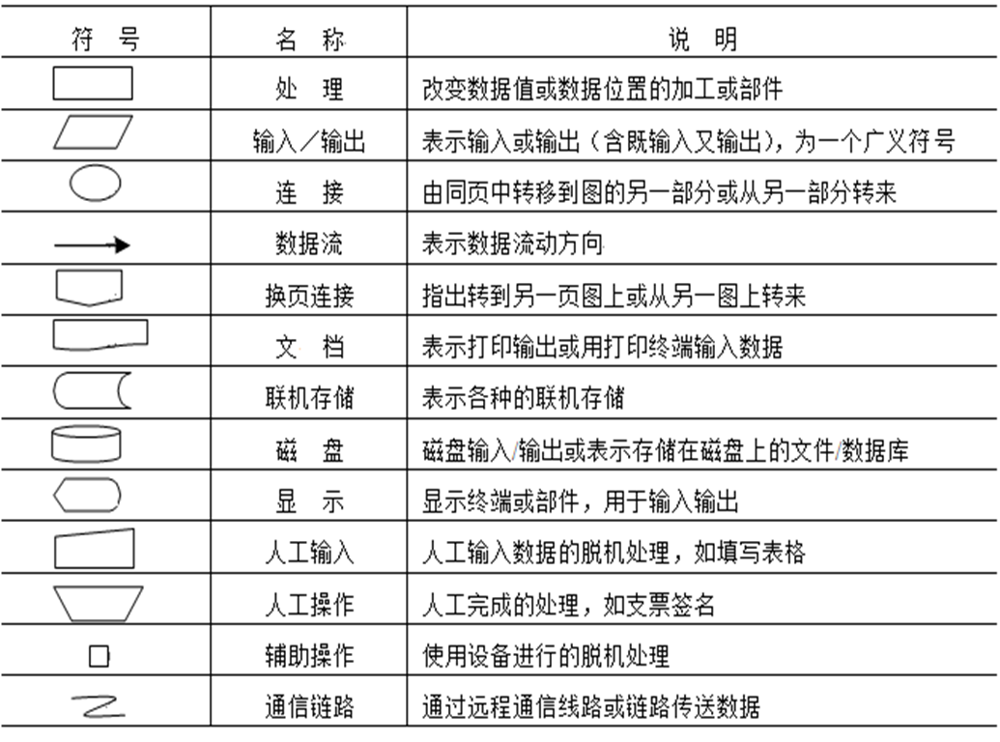
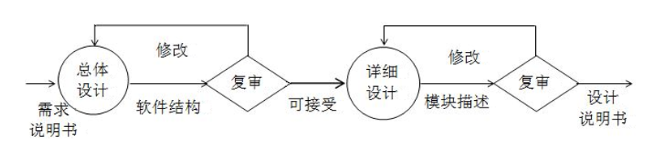
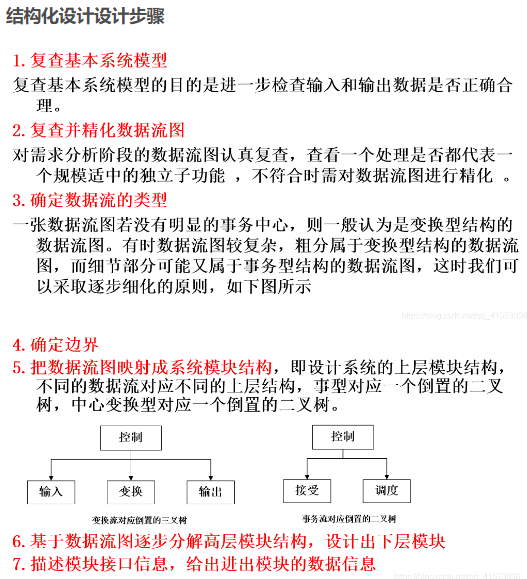

（应该是同校同学整理的，很详细）知识复习：https://iamlzy.blog.csdn.net/article/details/103662123

2023题型：选择，判断，名词解释，简答，分析论述

## 讨论题

> Powered by GPT

1. 软件项目开发首先要做的事是什么？

（按照瀑布模型来说是可行性分析）明确项目目标和需求，以便能够确定项目的范围和规模，制定相应的计划和时间表，以及确定所需的资源和技术。

2. 你认为软件系统应具备的最重要的特性是什么？

（1）可靠性：软件系统应该能够在各种情况下稳定、可靠地运行，以确保其功能能够持久地满足用户的需求。这包括预防和处理错误，以及能够迅速恢复系统的正常运行状态。（2）可维护性：软件系统应该易于维护和修改，以便在应用程序或系统中出现错误或需要添加新功能时进行调整。这包括代码的可读性、可扩展性、可测试性和文档化等方面。（3）可用性：软件系统应该易于使用，并能够满足用户的需求。这包括用户界面的友好性、反应速度、可访问性等方面。（4）安全性：软件系统应该能够保护数据和系统免受恶意攻击和其他安全威胁。这包括对数据的加密、用户身份验证和访问控制等方面。（5）可扩展性：软件系统应该能够在需要扩展时进行扩展，以容纳更多的用户、处理更多的数据或支持更多的功能等。这包括系统的可伸缩性、模块化和可重用性等方面。

3. 你认为怎样分工是最合理的？

（1）按功能模块分工：将开发团队分为不同的小组，每个小组专注于开发不同的功能模块。这种分工可以提高开发效率，但可能会导致不同模块之间的集成问题。（2）按技术领域分工：将开发团队按照不同的技术领域分组，例如前端、后端、数据库等。这种分工可以提高开发质量和可维护性，但可能会导致团队协作难度增加。（3）按角色分工：将开发团队按照不同的角色分组，例如开发人员、测试人员、项目经理等。这种分工可以提高团队协作和项目管理效率，但可能会导致某些人员在开发过程中无法全面了解整个项目。

4. 目前流行的软件生命周期模型有哪些？分别举例说明

（1）瀑布模型：这是最早的软件生命周期模型之一。它是基于阶段分离的思想，将软件开发分为需求分析、设计、编码、测试和维护五个阶段，每个阶段都有明确的输入和输出。该模型的优点是适用于大型和复杂的软件开发，缺点是不够灵活，迭代周期长，无法适应需求变化频繁的环境。

（2）螺旋模型：螺旋模型是一种风险驱动的软件开发模型，将软件开发过程分为计划、风险评估、工程实现和客户评估四个阶段。该模型的优点是能够及时识别和处理风险，同时支持迭代开发，缺点是需要专业的风险评估能力和经验，适用范围有限。

（3）增量模型：增量模型是基于逐步增量的思想，将软件开发分为多个增量，每个增量都包含完整的开发流程，可以单独交付并应用。该模型的优点是迭代周期短，适应需求变化频繁的环境，缺点是需要开发人员有良好的模块化设计和集成能力。

> 剩下的请看书。

5. 软件测试的目的是什么？你认为应该怎么进行软件测试？

软件测试的主要目的是（尽可能找到软件中的错误，而不是证明软件的正确性）确保软件的质量和稳定性，并发现潜在的缺陷和问题。软件测试可以帮助开发人员识别和修复软件中的错误，提高软件的可靠性和性能，减少软件故障和维护成本，同时提高用户满意度和信任感。

以下是进行软件测试的一些常用方法和技术：

（1）单元测试：对软件的最小可测试单元进行测试，如函数、类和模块等。

（2）集成测试：测试不同模块之间的接口和交互是否正常工作。

（3）有效性测试：测试软件是否满足用户需求和预期的功能，确保软件具有正确的行为和结果。

（4）系统测试：测试整个系统的功能和性能是否符合需求和规格说明。

（5）验收测试：由用户或客户对软件进行测试，以确保软件满足其需求和期望。

（6）性能测试：测试软件在不同负载和压力下的性能和响应时间。

（7）安全测试：测试软件的安全性，包括数据保护、身份验证和授权等方面。

6. 什么是软件危机？软件危机的主要表现是什么？怎样消除软件危机？

软件危机指在计算机软件的研发、运行、维护和管理过程中，出现一系列严重问题的现象。

表现有：（1）软件运行经常出现功能、性能不满意或出现故障等现象。

​    （2）软件产品的质量、可靠性和安全等方面时常达不到标准。软件产品质量难以保证，甚至在开发过程中就被迫中断。

​    （3）软件开发管理差，对成本和进度难估计准确。

​    （4）系统时常出现无法维护、升级或更新现象。

​    （5） 开发效率低，无法满足应用迅速发展与提高实际需要。

​    （6）研发成本难控制，在总成本中所占的比例不断大幅上升。

​    （7）软件开发没有标准、完整、统一规范的文档资料。软件不仅只是程序，还应有一整套规范文档资料和售后服务。

如何解决：（1）技术方法：运用软件工程的技术、方法和标准进行规范

（2）开发工具：选用先进高效的软件工具，采用切实可行的实施策略

（3）组织管理：研发机构需要组织高效、管理制度和标准严格规范、职责明确、质量保证有力、团结互助、齐心协力，注重文档及服务

7. 什么是项目风险？如何在工程化开发软件中降低项目风险？

项目风险是指在进行项目开发过程中可能会遇到的不确定性和潜在的问题，这些问题可能会导致项目无法按时完成、超出预算或无法满足客户需求等不良后果。

（1）制定详细的项目计划和进度安排，包括里程碑和关键路径的设置，以确保项目按时完成。（2）对项目进行全面的需求分析和风险评估，识别可能的技术难点和潜在问题，并制定相应的风险应对计划。（3）采用成熟的开发方法和工具，如敏捷开发、测试驱动开发、代码审查等，以提高软件质量和开发效率。（4）建立有效的沟通渠道，确保项目团队成员之间的信息交流和协作，及时解决问题和调整计划。（5）建立完善的质量保证体系，包括代码审查、测试、文档编写和用户反馈等环节，以确保软件符合客户需求和质量标准。（6）招募具有相关经验和技能的开发人员，保证团队成员的素质和能力，减少人员风险。（7）定期进行项目进展报告和风险评估，及时调整计划和应对措施，以确保项目按计划进行。

8. 你认为软件开发中人员应该有几种，各自的职责是什么？

PL是项目组长，PM是项目经理，PT是项目测试人员，PG是项目编程人员。

（1）项目组长职责：配合项目经理工作，管理组内成员，完成小组计划工作。

（2）项目经理职责：全面掌管项目人员、进度，以及跟甲方沟通。

（3）项目测试人员职责：对项目编程人员开发的程序进行测试，发现隐藏BUG。

（4）项目编程人员：按照项目组长安排，进行项目开发编程。

9. 你认为对于初学者来说，最合适的软件开发模型是哪个？【直接瀑布模型】
10. 软件开发中的成本有哪些？尝试举例说明

（1）人力成本：包括人员薪酬、培训、福利等。软件开发需要很多人力资源，包括开发人员、测试人员、项目经理、架构师等等。

（2）硬件成本：包括服务器、电脑、网络等设备。软件开发需要使用很多硬件设备，包括开发电脑、测试服务器、生产服务器等等。

（3）软件工具成本：包括开发工具、测试工具、集成工具等。软件开发需要使用很多软件工具，包括开发工具、测试工具、集成工具等等。

（4）管理成本：包括项目管理、质量管理、风险管理等。软件开发需要进行很多管理工作，包括项目管理、质量管理、风险管理等等。

（5）测试成本：包括测试人员、测试设备、测试工具等。软件开发需要进行很多测试工作，包括单元测试、集成测试、验收测试等等。

（6）维护成本：包括升级、修复、维护等。软件开发完成后还需要进行维护工作，包括升级、修复、维护等等。

（7）场地成本：包括租赁办公室、购买或租赁会议室等。

11. 开发软件的时候如何保证软件质量，请举例说明？

（1）编写高质量的代码：编写高质量的代码是确保软件质量的重要步骤之一。编写高质量的代码意味着代码易于理解、易于维护、易于测试和易于扩展。开发人员可以使用一些技术，如代码复审、单元测试、集成测试、代码覆盖率分析等，来确保代码质量。

（2）使用自动化测试：自动化测试是一种测试技术，可以通过编写测试脚本或使用测试自动化工具来自动执行测试。自动化测试可以提高测试效率，减少测试时间，并且可以在软件中引入更多的测试用例，从而提高软件的质量。

（3）代码审查：代码审查是一种评估代码质量的方法，是由开发人员之间相互检查代码的过程。代码审查可以帮助发现代码中的错误和潜在问题，从而提高代码可读性和可维护性。

（4）使用持续集成和持续交付：持续集成和持续交付是一种软件开发流程，可以在整个开发过程中自动化构建、测试和部署软件。持续集成和持续交付可以确保软件在开发过程中保持稳定和可靠，并且可以提高软件的质量。

12. 软件需求的重要性有哪些？

（1）明确开发目标：软件需求是实现软件开发目标的关键。在软件开发过程中，软件需求定义了软件的功能、性能、界面和其他相关的要求，有助于开发团队明确目标，规划开发进程，避免偏离方向。

（2）提高客户满意度：软件需求是客户与开发团队之间沟通的重要媒介。通过客户对软件需求的描述，开发团队可以更好地理解客户的需求，减少开发过程中的误解和沟通成本，从而提高客户满意度。

（3）降低开发成本：软件需求可以帮助开发团队更好地理解软件开发的范围和目标，从而在开发过程中减少需求变更和返工，降低开发成本，提高开发效率。

（4）提高软件质量：软件需求是保障软件质量的基础。通过对软件需求的充分理解和分析，开发团队可以在软件开发过程中更好地规划测试用例，确保软件功能的正确性和稳定性，提高软件质量。

（5）方便项目管理：软件需求可以作为项目管理的重要依据，帮助开发团队制定计划、分配任务、监控进度，从而保证项目的顺利进行和交付。

13. 进行需求分析的时候应该注意哪些环节？

（1）明确需求分析的目的和范围，确定分析的重点和方向。

（2）收集需求信息，包括用户需求、业务需求、技术需求等，可以采用调查问卷、访谈、焦点小组等方法。

（3）对收集到的需求信息进行梳理和整理，将其转化为需求文档或需求规格说明书，明确需求的优先级和稳定性。

（4）分析需求，包括需求的可行性、一致性、完整性、可测试性等方面，识别需求之间的相互影响和依赖关系。

（5）与相关人员进行沟通和协商，验证需求的正确性和可行性，并进行必要的调整和修改。

（6）编制需求变更管理计划，规定需求变更的流程和控制方式，确保需求变更的合理性和有效性。

（7）审查和确认需求，确保需求的准确性、清晰性和可行性，为后续的设计、开发和测试工作打下坚实的基础。

14. 需求变更指的是什么？如何实施？

需求变更是指在项目或产品开发过程中，原本已经确定的需求或规格发生变化，需要进行修改或调整的情况。

需求变更的实施通常需要经过以下步骤：

1. 提出变更请求：变更请求可以由项目或产品的客户、用户、利益相关者或开发人员等提出。
2. 进行评估：针对变更请求，需要进行评估，分析变更对项目或产品的影响，包括预计的成本、时间、资源等方面的影响。
3. 决策：评估完变更请求后，需要进行决策，确定是否批准变更请求。如果变更请求被批准，需要更新项目或产品的相关文档，如需求文档、设计文档等。
4. 实施变更：在变更被批准后，需要进行变更的实施。变更实施的具体方法和步骤取决于变更的性质和具体情况，可能需要进行开发、测试、部署等活动。
5. 验证变更：变更实施完成后，需要进行验证，确保变更已经正确地被实施。验证可以包括功能测试、性能测试、用户验收测试等。
6. 更新文档：变更实施完成后，需要更新相关文档，包括需求文档、设计文档、测试文档等。

15. 用户在工程化开发软件的过程中，参加了哪些阶段？为什么要参加这些阶段?

1. 需求分析阶段：在这个阶段中，软件开发团队会与客户或业务人员沟通，收集并分析用户需求，以确定软件需要实现的功能和特性。这个阶段的目的是确保开发团队和用户对软件的期望达成一致，为后续的开发工作提供指导。
2. 测试阶段：在软件开发完成之后，用户需要参与测试，以确保软件能够满足自己的需求。用户可以对软件进行功能测试、性能测试、兼容性测试等，发现并反馈软件中存在的问题和缺陷，帮助开发团队修复问题和提高软件质量。

目的：确保软件的质量和可靠性，提高软件的性能和用户体验，并加速软件开发过程。

## 1 软件工程基础

软件工程三要素：软件工程**方法**，软件**工具**，软件工程**过程**

### 1.4 软件开发模型

- 瀑布模型：

分为计划时期（**问题定义，可行性研究，需求分析**），开发时期（**概要设计，详细设计，软件实现，软件测试**），运行维护时期（**运行维护**）

优点：（1）开发过程的顺序性（2）统筹兼顾不过早编程（3）严格要求保证质量

缺点：充满回溯且相互重叠的软件开发 过程硬性地分为多个阶段，随着开发软件规模的增加， 造成的危害大增。为了描述软件开发过程中可能回溯 对瀑布模型进行了改进，开发各阶段可能循环重复。 

- 快速原型模型：快速原型模型最适合于可以先尽快构建成一个原型的应用系统。

- 增量模型
- 螺旋模型
- 喷泉模型：适用于面向对象开发方法

## 2 可行性分析和开发计划

### 2.1 软件问题的调研和定义

**软件问题定义**是指在对拟研发软件进行可行性分析和立项之前，对有关的主要需求问题进行初步调研、确认和描述的过程。

软件问题定义的内容：确定软件或项目名称；软件项目提出的背景；软件目标及任务；软件类型及性质；软件服务范围；基本需求  ；软件环境；主要技术；基础条件

### 2.2 可行性分析

概念：是对拟研发软件项目（或称为申报的“拟研发立项问题”）分析论证可行性和必要性的过程

主要任务是： 决定软件项目“做还是不做（是否可行）”、及完成对可行项目的“初步方案”

【P37】可行性分析包括：**技术**可行性分析、**经济**可行性分析、**社会**可行性分析、**开发方案**可行性分析和**运行**可行性分析，主要是前三项

可行性分析的过程与步骤：（1）**明确系统规模和目标**（2）认真研究现行系统（3）确定系统逻辑模型（4）制定并推荐技术方案（5）**编写可行性分析报告**（6）评审论证

### 2.4 【P46】系统流程图

### 2.5 软件开发计划及方案

软件开发计划**制定的依据**是问题定义报告。

 项目开发计划是一个管理性文档，主要内容包括：（1）项目概述 （2）实施计划（3）人员组织及分工（4）交付产品（5）其他内容

## 3 软件需求分析

### 3.1 软件需求分析概述

软件需求分为3个层次：业务需求；用户需求；功能需求；此外还包括非功能需求

软件需求分析是**软件项目立项决定开发后的首要工作**

【P61】软件需求分析的特点：（1）指标确定难（2）需求动态性（3）交流共识难（4）完备一致难（5）深入完善难

 软件需求分析主要目的：获取用户及项目的具体需求，通过对实际需求的获取、分析、文档化和验证等需求分析过程, 为软件的进一步设计和实现提供依据。

### 3.2 软件需求分析的任务和过程

需求分析的基本任务：通过软件开发人员与用户的交流和讨论，准确地分析理解原系统，定义新系统的基本功能、性能、开发时间、投资情况人员安排等，并获得需求规格说明书。

具体任务：在可行性研究的基础上，确定对问题的综合需求，包括：功能需求、性能需求、环境需求和用户界面需求；另外还有系统的可靠性、安全性、可移植性和可维护性等方面的需求。

需求分析的具体任务：

- 确定目标系统的具体要求

（1）确定功能需求，画出功能结构图，完成新系统的功能点列表，即功能模型。有时将性能模型、界面模型和接口模型的内容都合并其中，功能模型可用Use Case矩阵/图表示。

 （2）获取性能需求：性能需求是为了保证软件功能的实现和正确运行，对软件所规定的效率、可靠性、安全性等规约

 （3）明确处理关系，列出接口列表

> 接口：两个或多个系统之间进行数据交互

 （4）确定系统运行环境及界面

- 建立目标系统的逻辑模型

软件系统的逻辑模型分为：数据模型（采用E-R图描述）、功能模型（常用数据流图来描述）和行为模型（常用状态转换图来描绘系统的各种行为模式（状态）和不同状态间的转换）。

数据字典用来描述软件使用或产生的所有数据对象。

- 编写需求文档 ，验证确认需求

需求分析的过程：（1）需求获取（2）需求描述（3）需求有效性验证（4）完成需求文档

### 3.3 【P67】软件需求分析方法

- 功能分解方法

- **结构化分析方法**（SA）

**数据流方法比较重要**，结构化分析=数据流+数据处理+数据存储+端点+处理说明+数据字典

- 信息建模方法

有序模型：功能模型，信息模型，数据模型，控制模型，决策模型。采用工具：ER图

- 面向对象的分析

### 3.4 结构化分析方法

结构化分析方法总的指导思想就是`自顶向下，逐步求精`，其基本原则是抽象与分解。

结构化分析的步骤：（1）构建原系统物理模型（2）抽象出原系统的逻辑模型（3）简历新系统逻辑模型（4）进一步补充和优化

结构化分析导出的分析模型包括 `数据模型､功能模型和行为模型`，这些模型以“数据字典”为核心

**实体关系图**(E-R图Entity Relationship Diagram)作为数据建模的基础；

**数据流图**(DFD，Data Flow Diagram)作为功能建模的基础；

**状态转换图**(STD，State Transition Diagram)作为行为建模的基础｡

### 3.5 结构化分析建模工具

- 实体关系图

> 三个基本组成部分：实体，联系，属性

- 【P72】数据流图DFD

| 名 称         | 图 例  | 说 明                                                        |
| ------------- | ------ | ------------------------------------------------------------ |
| 起点(或终点)  | 矩形框 | 数据流的起点或终点，表示数据源和数据宿                       |
| 加工或处理    | 椭圆   | 表示对流到此处的数据进行加工或处理，即对数据的算法分析与科学计算 |
| 输入/输出文件 | 双横线 | 表示输入/输出文件，说明加工/处理前的输入文件，记录加工/处理后的输出文件，也可单线 |
| 数据流连线    | 箭头   | 表示数据流的流动方向                                         |

- 数据字典。组成：数据流，数据项，文件（文件存储）及基本加工

- 结构化过程描述（加工过程）。描述工具：**结构化语言，判定树，判定表** 

- 【P83】状态转换图 :star: :star:

状态分为：初始状态，终态，结束状态，中间状态

初始状态只有一种，中间状态可能有多种，终止状态可能有多种。

### 3.6 软件需求分析文档

包括系统需求规格说明，软件需求规格说明，软 件需求规划说明格式

## 4 软件设计

### 4.1 软件设计概述

软件设计分为两个阶段：总体设计（概要设计）和详细设计（过程设计）。

总体设计总体目标：将软件需求分析阶段确定的等各种功能对应的逻辑模型，转化为具体的物理模型，最后完成软件设计说明书。

> 总体设计主要确定总体架构、总体设计文档和方案。详细设计是具体细化，确定组成模块及联系、处理过程、数据库及网络、界面设计、软件设计文档（含具体方案）等。

软件设计的过程：

### 4.2 总体设计

总体设计的主要任务：新的系统模块的组成以及模块之间的调用关系

总体设计的总原则：由宏观到微观，逐步求精

软件设计基本原则： 模块化，抽象，内聚和耦合，子系统及模块划分，信息隐蔽等

> 内聚：一个模块内部各个组成元素之间相互结合的紧密程度
>
> 耦合：软件模块之间互相依赖的方式和程度

（子系统及模块划分中）软件体系结构设计的三要素：程序构件的层次结构，构件之间的交互方式，数据的结构

模块结构图（SC）是描述软件结构的图形表示方法

【P98】软件层次结构中的相关指标：深度，宽度，扇出，扇入（需要明白啥意思）

---

总体设计的方法有三类：（1）结构化设计方法（2）面向数据结构的Jackson方法（3）面向对象设计方法

结构化设计方法（SD）分为**总体设计**（1. 从DFD图中导出初始的模块结构图 2.改进初始的模块结构图）和**详细设计**两个阶段。

结构化开发方法的**目标**是确定设计软件结构的一个系统化的途径。

一般将 DFD 图分为两种典型类型: 中心变换型和事务处理型 。

中心变换型的数据流图基本上呈线性形状，可以比较明显地分为 输入、变换(或加工)、输出三部分，其中变换部分是系统的主要工作

事务处理型的数据流图常呈辐射状，一个加工(事务中心)将它的输入分离成若干种发散的数据流，从而形成若干条活动的路径，然后根据输入值选择其中的一条路径处理，

在中型以上DFD中，常用变换流为主，事务流为辅的方法

### 4.3 软件详细设计

详细设计任务：主要完成对软件模块的内部过程具体设计和描述

详细设计使用的结构化程序设计是一种设计程序技术，采用自顶向下、 逐步求精的设计方法和单入口单出口的控制结构。

【P105】详细设计（各模块的设计）工具：程序流程图（单口入，单口出的控制结构），结构流程图，问题分析图

### 4.4 数据库设计概述

概念结构设计，逻辑结构设计，物理结构设计

为什么数据要进行规范化：消除数据冗余，消除多义性，使关系的概念单一化，方便操作，使关系模式更灵活，保证数据的一致性

### 4.5 网络系统设计概述

网络技术的选择是选择网络技术的结构和技术栈

网络技术的选择：局域网技术，广域网技术

网络的分层设计：客户机/服务器结构，浏览器/服务器结构

### 4.6 用户界面设计

用户界面设计的原则：界面的合理性，简便易操作，便于交互控制，媒体组合恰当

## 6 软件编程实现

### 6.1 软件编程实现基础

主要任务：将软件详细设计的结果转化为目标软件；具体任务：对详细设计的工作进行具体实施

软件实现是通过 **编码、调试、集成和测试**，完成软件产品的过程；软件实现包括 **编程和单元测试**。

软件实现的开发策略主要有3种：（1）OOP开发策略。（先将业务对象转化为数据表，在数据库中创建物理表，然后编写测试业务对象的程序）（2）自顶向下策略（从顶层模块开始，逐步向下层模块延伸，直到最后编写最底层模块）（3）自底向上策略（从数据层逐步向业务层和界面层过度）

软件实现的有效管理：将程序员组成开发小组, 以团队承担编程工作。小组组成具有平等协作制、组长负责制和技能互补制三种形式。

出现软件危机最主要的两个因素就是 **开发成本难控制和开发计划难落实。**

### 6.2 软件编程语言和技术方法

选择软件编程语言的要素和准则：适合软件应用领域；有利软件运行环境；软件开发人员熟悉；有助于性能实现；算法和计算复杂性简便；数据结构的复杂性低

通常优先选择高级语言，主要因为高级语言明显优于低级语言。

常见软件编程方法：模块化编程；结构化编程方法（自顶向下，逐步求精）；面向对象设计OOP方法

软件编程规范：源程序文档化；数据说明；语句构造；输入和输出；程序效率和安全可靠性

### 6.5 软件实现文档

软件实现文档包括： 软件产品规格说明(SPS)、计算机编程手册(CPM)和软件用户手册(SUM)。

**计算机编程手册(CPM)**  提供了一个程序员理解在给定的计算机上编程所需的信息，主要说明软件的编程环境和信息；

**软件用户手册(SUM)** 是为由用户操作的软件而编写的，描述手工操作用户应安装和使用软件系统或子系统。还包括软件操作的一些特别方面，如特定岗位或任务的指令等。

## 7 测试与维护

### 7.1 软件测试概述

软件测试：在规定的条件下对软件程序进行测试运行操作，以发现程序错误，衡量软件质量，并对其是否能满足设计要求进行评估的过程

**软件测试的目的是：** 尽可能多的找到软件中的错误，而不是证明软件的正确。

软件测试的步骤：单元测试，集成测试，有效性测试，系统测试

> 测试不能证明软件是正确的，也不能证明错误的不存在，它只能证明错误的存在

软件测试准则：

- 所有测试都应该能追溯到用户需求
- 应当尽早地不断地进行软件测试或评审

### 7.2 软件测试的特点及过程

测试用例由**输入数据和预期输出结果**两部分组成，并兼顾**合理的输入数据和不合理的输入数据。**

软件测试特点：1 测试成本很高；2 **不可能进行穷举测试**；3 测试具有破坏性；4 软件测试是整个软件开发过程中的一个独立的阶段，又贯穿到软件开发的整个阶段

测试步骤：**单元测试，集成测试，有效性测试，系统测试**（性能测试，用户测试），最后进行验收测试后交付

### 7.3 软件测试阶段及任务

单元测试：也称为模块测试，是对功能独立运行的程序模块的检测。

通常，单元测试主要使用**白盒测试技术**，而且对多个模块的测试可以并行地进行 。目的是发现各模块内部可能存在的各种问题

单元测试工作的**输入**为：程序源代码和软件详细设计报告；单元测试结束的**输出**为：程序单元测试记录”和“软件(后续)测试计划”等。 

-----

集成测试：在单元测试的基础上，将所有模块按照设计要求（如根据结构图）组装成为子系统或系统，进行集成测试。

集成测试工作输入:“集成测试计划”,“概要设计”,“测试大纲”

集成测试结束输出:“集成测试bug记录”,“集成测试分析报告”

---

有效性测试：有效性测试也称确认测试。有效性测试是在模拟的环境下，运用**黑盒测试**的方法，验证被测软件是否满足需求规格说明书列出的需求。

有效性测试工作输入：“软件测试计划”、“用户需求分析报告”、“用户操作手册”和“安装手册”。

测试结束的输出：“软件测试bug记录”和“软件测试分析报告”。

---

系统测试：是针对整个产品系统进行的测试，**目的**是验证系统是否满足了需求规格的定义，找出与需求规格不符或与之矛盾的地方，从而提出更加完善的方案。

**目标** 主要是发现并纠正软件开发过程中所产生的错误。

系统测试主要通过与用户需求指标进行详尽对比，查找软件与指标符合要求情况。其方法一般采取**黑盒测试**。

### 7.4 软件测试策略及面向对象测试

软件测试策略是指软件测试的思路模式。

测试策略主要内容：测试目的，测试用例，测试方法，测试通过标准和特殊考虑

### 7.5 测试方法、用例和标准

**黑盒测试**：“黑盒”则指测试人员只知道被测软件的界面和接口外部情况，不必考虑程序内部逻辑结构和特性，只根据程序的需求分析规格说明，检查其功能是否符合。

测试模块之间接口，适合采用黑盒测试。

黑盒测试方法：

- 等价分类法

  - 划分等价类：根据输入条件将输入数据划分为等价类，划分为有效等价类和无效等价类

  - 设计测试用例

  1. 形成等价类表，每一等价类规定一个唯一的编号； 
  2. 设计一测试用例，**使其尽可能多地覆盖尚未覆盖的有效等价类**，重复这一 步骤，直到所有有效等价类均被测试    用例所覆盖；
  3. 设计一新测试用例，**使其只覆盖一个无效等价类**，重复这一步骤直到所有    无效等价类均被覆盖；
  
- 边界值分析法

---

**白盒测试**：白盒测试主要是对程序内部结构和执行路径的测试，也称透明盒测试、开放盒测试、结构化测试、基于代码测试和逻辑驱动测试等。

---

软件测试主要文档包括：

软件测试计划、测试设计说明、测试用例说明、测试规程说明、测试项传递报告、测试日志、测试事件报告、测试总结报告等。

### 7.6 软件调试和发布

**软件调试的概念**：在软件测试的基础上进一步纠正和确认相关错误或问题

调试工作**步骤组成**：（1）定位、查找其根源（确定错误）（2）纠错、解决软件问题并确认（修改错误）

【P224】软件调试的方法：（1）强行排错（2）回溯法排错（3）归纳法排错（4）演绎法排错

软件维护的方法或内容：（1）完善性维护（2）适应性维护（3）纠错性维护（4）预防性维护

## 8 软件项目管理

### 8.1 软件项目管理概述

软件项目管理是指对软件项目的整个生存周期过程的管理，按照项目任务要求，合理的利用资源，为保证软件产品质量所做的工作

软件项目管理的**主要特点** ：(1)目标产品抽象难度量。(2)项目独特定制化生产。(3)智力密集技术复杂。  (4)人为因素影响大。

**项目管理过程**： 项目启动、项目计划、组织实施、项目监控和项目验收 五个阶段。

### 8.2 软件项目启动与组织管理

**软件项目管理先于任何技术活动之前开始，并且贯穿于软件的整个生命周期。**

有效的软件项目组织管理集中在4个P上，即人员(Person)、产品(Product)、过程(Procedure)和项目(Project)。

软件项目的组织管理：（1）选定软件项目团队及要求（2）团队作用的发挥（3）科学用人

### 8.3 软件项目进度管理

软件项目估算：软件规模估算，工作量估算，成本估算，进度估算

过程调整是项目计划中首要任务

任务安排计划常用图示方法工具： 甘特图，网络图

### 8.4 软件项目的过程管理

软件项目的需求管理：开发过程需要经历**需求获取、需求分析、需求规格编写、需求验证**四个往复确认的阶段。

---

软件项目质量管理：主要内容包括**质量计划制定、质量保证和质量控制**三个过程

【P250】在全面软件质量管理模型中，质量管理有三大类：**技术评审**、过程检查、软件测试

---

软件配置管理(SCM)：是对产品进行标志、存储和控制，以维护其完整性、可追溯性及正确性而为软件开发提供的一套管理办法和活动原则。

软件配置管理要素如下：

- 软件配置项    

- 基线  功能基线  分配基线   产品基线

- 配置管理机构     配置管理委员会(SCCB)

---

软件项目的风险管理：是按照风险计划对项目进行全过程的管理。

风险分析的目的是建立应对处理及监控风险的策略。

一个有效的策略必须考虑三个问题：风险避免、风险监控、风险管理及意外事件计划（预案）

同每个风险相关的三元组(风险描述、发生概率、风险影响)是建立风险应对处理及避免或消除步骤的重要基础。

对风险采取主动的方法，则避免风险永远是最好的策略
### 8.5 软件项目监控与验收

软件项目评审：包括评审准备、评审过程和评审报告三个过程，**技术评审对象**主要是规范和设计，而管理评审关注的是项目计划和报告

项目收尾与验收的组织构成包括：项目接收方、项目开发团队和项目监理人员。
